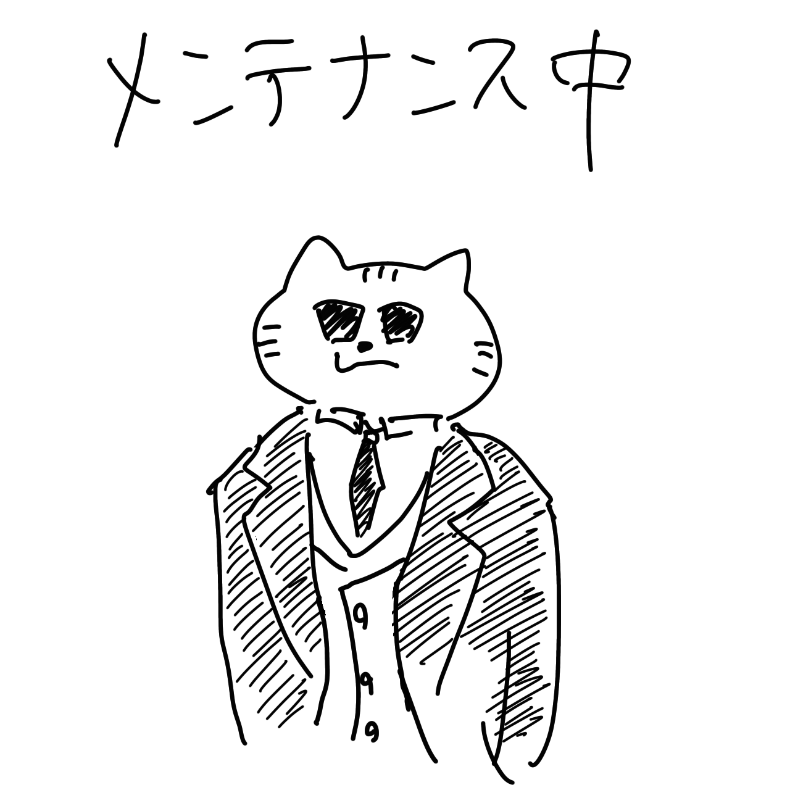

# ラーキーノート

### 目次

見出しのリンクを押すと飛べる場合があります。ブラウザの戻るボタンを押すと目次に戻れます。

- [ラーキーノート](#ラーキーノート)
    - [目次](#目次)
    - [更新履歴](#更新履歴)
    - [概要](#概要)
      - [サイト情報](#サイト情報)
      - [この文書の必要性](#この文書の必要性)
      - [補足](#補足)
    - [ヌーソロジー](#ヌーソロジー)
      - [概要](#概要-1)
      - [ヌーソロジーについて学ぶようになったきっかけ](#ヌーソロジーについて学ぶようになったきっかけ)
      - [半田広宣氏について](#半田広宣氏について)
      - [ヌーソロジーの学び方について](#ヌーソロジーの学び方について)
        - [ヌーソロジーの注意点](#ヌーソロジーの注意点)
          - [ヌーソロジーはほどほどに](#ヌーソロジーはほどほどに)
          - [ヌーソロジーは炙り出し](#ヌーソロジーは炙り出し)
          - [顕在化のヌースと潜在化のヌース](#顕在化のヌースと潜在化のヌース)
          - [ヌーソロジーは淡々と](#ヌーソロジーは淡々と)
      - [半田広宣氏の書籍](#半田広宣氏の書籍)
      - [ヌーソロジー関連サイト（一部）](#ヌーソロジー関連サイト一部)
      - [ヌーソロジー版"三種の神器"](#ヌーソロジー版三種の神器)
      - [NC（ヌースコンストラクション）について](#ncヌースコンストラクションについて)
      - [ケイブコンパスについて](#ケイブコンパスについて)
      - [ヘキサチューブルについて](#ヘキサチューブルについて)
        - [ヘキサチューブル談義](#ヘキサチューブル談義)
      - [「ある、いる、なる」について](#あるいるなるについて)
      - [木の実と、食べる鳥と、見つめる鳥のお話](#木の実と食べる鳥と見つめる鳥のお話)
      - [トピック](#トピック)
        - [事実性に基づく思考](#事実性に基づく思考)
        - [SU(2)（複素二次元特殊ユニタリー変換群/エス・ユー・ツー）](#su2複素二次元特殊ユニタリー変換群エスユーツー)
          - [半田さんのツイート](#半田さんのツイート)
          - [関連サイト](#関連サイト)
          - [半田さんのブログ記事](#半田さんのブログ記事)
        - [元素の生成](#元素の生成)
        - [十種の神宝（とくさのかんだから）](#十種の神宝とくさのかんだから)
        - [実在ということについて](#実在ということについて)
        - [カイラル対称性の破れ](#カイラル対称性の破れ)
        - [客観的な3次元空間について](#客観的な3次元空間について)
        - [イマージュについて](#イマージュについて)
        - [時間と別れるための50の方法](#時間と別れるための50の方法)
        - [『シリウス革命』の付箋](#シリウス革命の付箋)
        - [『光の箱舟』について](#光の箱舟について)
          - [付箋](#付箋)
          - [関連ツイート](#関連ツイート)
        - [無核質の反映は植物](#無核質の反映は植物)
        - [垂質の双対性について](#垂質の双対性について)
        - [電気について](#電気について)
        - [色即是空、空即是色](#色即是空空即是色)
        - [生命の樹について](#生命の樹について)
        - [ラカンのシェーマL](#ラカンのシェーマl)
        - [思形の顕在化](#思形の顕在化)
        - [巻き込みと繰り広げ](#巻き込みと繰り広げ)
    - [哲学について](#哲学について)
      - [ヌーソロジーに関係する哲学](#ヌーソロジーに関係する哲学)
      - [ハイデガーについて（100分de名著 - NHK）](#ハイデガーについて100分de名著---nhk)
        - [補足](#補足-1)
        - [番組の概要](#番組の概要)
        - [存在（ザイン）と存在者（ザイエント）](#存在ザインと存在者ザイエント)
        - [現存在（ダーザイン）](#現存在ダーザイン)
        - [世界](#世界)
        - [本来性と非本来性](#本来性と非本来性)
        - [世人（せじん）](#世人せじん)
          - [例1 空気を読む人](#例1-空気を読む人)
          - [例2 人の真似](#例2-人の真似)
        - [頽落（たいらく）](#頽落たいらく)
          - [アドルフ・アイヒマンの例](#アドルフアイヒマンの例)
        - [世人を克服する？ためのキーワードその１　"死"](#世人を克服するためのキーワードその１死)
          - [例1](#例1)
          - [例2](#例2)
        - [先駆（せんく）](#先駆せんく)
        - [世人を克服する？ためのキーワードその２　"良心の呼び声"](#世人を克服するためのキーワードその２良心の呼び声)
        - [投企（とうき）](#投企とうき)
        - [決意](#決意)
        - [根源的な不安](#根源的な不安)
        - [死への先駆的決意性](#死への先駆的決意性)
        - [ハイデガーのナチスへの加担（第4回より）](#ハイデガーのナチスへの加担第4回より)
          - [なぜハイデガーはナチスに加担してしまったのか。](#なぜハイデガーはナチスに加担してしまったのか)
          - [ハンナ・アーレント](#ハンナアーレント)
          - [ハンス・ヨナス](#ハンスヨナス)
          - [まとめ](#まとめ)
      - [ハイデガー哲学（半田さんのTwitterより）](#ハイデガー哲学半田さんのtwitterより)
      - [ハイデガー哲学（半田さんのブログ記事より）](#ハイデガー哲学半田さんのブログ記事より)
      - [ドゥルーズ『差異と反復』について](#ドゥルーズ差異と反復について)
        - [用語](#用語)
          - [表象=再現前化](#表象再現前化)
        - [半田さんのブログ記事](#半田さんのブログ記事-1)
    - [ヌーソロジーの活用](#ヌーソロジーの活用)
      - [衣食住とヌーソロジー](#衣食住とヌーソロジー)
    - [おすすめの本・サイト](#おすすめの本サイト)
      - [ひふみ神示（岡本天明・著）](#ひふみ神示岡本天明著)
      - [波動の法則（足立育朗・著）](#波動の法則足立育朗著)
      - [流生命（下ヨシ子・著）](#流生命下ヨシ子著)
      - [シュタイナー研究室](#シュタイナー研究室)
    - [Markdownについて](#markdownについて)
      - [Markdownの参考サイト](#markdownの参考サイト)
        - [VSCode : Markdown Preview Enhancedの見た目を良い感じにする](#vscode--markdown-preview-enhancedの見た目を良い感じにする)
        - [Visual Studio CodeのMarkdownプレビューにCSSを適用する](#visual-studio-codeのmarkdownプレビューにcssを適用する)
        - [VSCode でちょっとでもMarkdown する](#vscode-でちょっとでもmarkdown-する)
    - [YouTube動画のブックマーク](#youtube動画のブックマーク)
      - [科学](#科学)
      - [漫画・イラスト](#漫画イラスト)
    - [筆者について](#筆者について)
      - [基本項目](#基本項目)

### 更新履歴

GitHubの"History for larkynote/index.md"を参照ください。各履歴タイトルのリンクを押すと差分を確認できます。

[https://github.com/hirakisource/larkynote/commits/main/index.md](https://github.com/hirakisource/larkynote/commits/main/index.md)

### 概要
ラーキーによる文書（ページ）です。

#### サイト情報

項目|内容 |
:--|:--|
名前|ラーキーノート |
作者|ラーキー |
URL|[https://hirakisource.github.io/larkynote/](https://hirakisource.github.io/larkynote/)|
開設日|2021年4月12日（月） |
URL移転日|2022年4月24日（日）|

#### この文書の必要性
[筆者](#筆者について)による（筆者自身の）情報の整理および共有。

#### 補足

本文書はVSCodeという無料エディタを使用して作成しています。作成様式はmarkdown（マークダウン）形式で作成し、VSCodeの拡張機能によりHTML形式に変換しています。目次の自動生成機能も便利です。

### ヌーソロジー

#### 概要

ヌーソロジーとは、「神的知性に関する学」とされています（[参考サイト](https://noos-academeia.com/noosology.html)）。半田広宣氏（[Twitter](https://twitter.com/kohsen)）が提唱されています。氏のTwitterプロフィールによると、ヌーソロジーは「ポスト科学主義の宇宙論」とされています。

#### ヌーソロジーについて学ぶようになったきっかけ

もともと精神世界やスピリチュアル関連に興味があり、図書館で『[2013:人類が神を見る日](https://noos-academeia.shop/item_cdbook_jinkami/)』や『2013:シリウス革命』という本に出会ったのがきっかけです。

<blockquote class="twitter-tweet">
15歳頃に出会って半ば挫折したヌーソロジーも、30歳過ぎて少しは読めるようになってきた気がする。
&mdash; ラーキー (@larkynote) <a href="https://twitter.com/larkynote/status/1524961667825958918?ref_src=twsrc%5Etfw">May 13, 2022</a></blockquote> 

#### 半田広宣氏について

[Twitter](https://twitter.com/kohsen)のプロフィールには、次のように記載されています。

> （株）ヌースコーポレーション代表取締役。武蔵野学院大学客員教授。ヌーソロジーというポスト科学主義の宇宙論を提唱中。ヌーソロジーとは物質と精神を空間的視点から統合する具体的なイデア論です。著書に『2013:シリウス革命』、共著に『シュタイナー思想とヌーソロジー』『奥行きの子供たち』などがあります。

#### ヌーソロジーの学び方について

ヌーソロジーの[公式サイト](https://noos-academeia.com/)ではヌーソロジーに関するテキストが公開されていたり、関連書籍や過去に行われた講演のDVDなどが販売されています。また、公式のYouTubeチャンネルである[NoosAcademeia](https://www.youtube.com/channel/UCSUeMDLbghlODolafChfbgw)では、一部の講演などの動画が公開されています。半田さんは[ヌーソロジー・サロン](https://community.camp-fire.jp/projects/view/404531)というオンラインサロンもされていて、こちらでは半田さんに直接質問をすることもできます。

##### ヌーソロジーの注意点

###### ヌーソロジーはほどほどに

ヌーソロジーはわかるところだけわかればよいと思います。わからないところを無理に解釈やイメージしようとするのは迷化と呼ばれる状態をもたらし、悲しみなどマイナスの感情として体験されます。わかるところが増えていくと、炙り出しのように半田さんの言われていることが見えてくるようになります。

<blockquote class="twitter-tweet">
OCOTは人間が抱く悲しみの感情とは「迷化」だという。迷化とは生成からの遠ざかりである。時間と空間はその迷化を齎す迷路である。一方、喜びの感情とは「有機体の負荷」だという。有機体とはカタチを持たない精神のことで、これは時間と空間の中の光を指す。負荷とは生成への方向づけのことだ。
&mdash; 半田広宣 (@kohsen) <a href="https://twitter.com/kohsen/status/633833931985416192?ref_src=twsrc%5Etfw">August 19, 2015</a></blockquote> 

###### ヌーソロジーは炙り出し

ヌーソロジーは[炙り出し](https://ja.wikipedia.org/wiki/%E3%81%82%E3%81%B6%E3%82%8A%E3%81%A0%E3%81%97)のようなものだと言われています。ヌーソロジーで言われていることは最初はサッパリですが、事実性に基づいて、勝手な推測や妄想などを混ぜないで向き合っていると、次第に炙り出しのように自然とつながって浮かび上がってくる（何を言っているのかがわかってくる）ものだと思います。（ただし、自分なりにイメージしたり現実の感覚と照らし合わせることも大事だと思います。その結果としてヌーソロジーの理解が進む場合もあれば、派生として自分なりの世界観や知見が得られる場合もあると思います。各々の思想に関しては、混同せずに棲み分けることも大事だと思います。）

<blockquote class="twitter-tweet">
ヌーソロジーの内容としては、今日は核質と無核質の意味が何となく分かったような分からないようなー、程度の話だったと思います。ヌーソロジーは炙り出しのようにしか分からない、と言うより炙り出しのように解像度が徐々に浮き上がってくるところが快感になってくるので、それでいいんです（笑）。
&mdash; 半田広宣 (@kohsen) <a href="https://twitter.com/kohsen/status/1423958123627257860?ref_src=twsrc%5Etfw">August 7, 2021</a></blockquote> 

###### 顕在化のヌースと潜在化のヌース

<blockquote class="twitter-tweet">
ヌーソロジーはカバーするジャンルが広いので、最初に理解に取り組もうとするとき、どうしても自分の慣れ親しんだジャンルの知識を通して、理解のきっかけをつかもうとしてしまう。それはそれで構わないんだけど、それらはあくまでも「潜在化」としてのヌースの機序だということを頭に入れておくこと。
&mdash; 半田広宣 (@kohsen) <a href="https://twitter.com/kohsen/status/1318405715875123200?ref_src=twsrc%5Etfw">October 20, 2020</a></blockquote> 

<blockquote class="twitter-tweet">
別の言い方をするなら、ヌースを従来の何物かの説明に使おうとするときは「潜在化」のヌースを用いていて、それをチョクで空間思考と空間感情を含めて経験するときが「顕在化」のヌースと言っていいように思ってる。ヌースとは経験以前のものを発掘する作業だから。
&mdash; 半田広宣 (@kohsen) <a href="https://twitter.com/kohsen/status/1318410055780192256?ref_src=twsrc%5Etfw">October 20, 2020</a></blockquote> 

<blockquote class="twitter-tweet">
ちょっと言い訳も（笑）。 反転の空間認識を意識に立ち上げ、それを物質の構成と結びつけ、超越論的なものをその空間的経験の中に語っていくこと——それがヌーソロジーの本論だと思っているんだけど、コレ大げさじゃなて、人間の歴史には存在したことがない思考法。まぁ、だから「ヌース」なんだけど。
&mdash; 半田広宣 (@kohsen) <a href="https://twitter.com/kohsen/status/1195880369486065664?ref_src=twsrc%5Etfw">November 17, 2019</a></blockquote> 

###### ヌーソロジーは淡々と

<blockquote class="twitter-tweet">
だから、ヌース本論は淡々と無機的な図式だけを使って説明を試みていると思うといいよ。無色透明、何の色もついていない。ついているのはOCOT色だけといったところかね（笑）
&mdash; 半田広宣 (@kohsen) <a href="https://twitter.com/kohsen/status/1439780478203035653?ref_src=twsrc%5Etfw">September 20, 2021</a></blockquote> 

#### 半田広宣氏の書籍

1. 半田広宣. 2013:人類が神を見る日. 徳間書店, 1997, 366p., ISBN 9784198606725.
1. 半田広宣. 2013:シリウス革命. たま出版, 1999, 621p., ISBN 9784812700273.
1. 半田広宣, 砂子岳彦. 光の箱舟 2013:超時空への旅. 徳間書店, 2001, 378p., ISBN 9784198613525.
1. 半田広宣. 2013:人類が神を見る日 アドバンスト・エディション. 徳間書店, 2008, 453p., ISBN 9784198624798.
1. 半田広宣, 福田秀樹. シュタイナー思想とヌーソロジー 物質と精神をつなぐ思考を求めて. ヒカルランド, 2017, 743p., ISBN 9784198613525.
1. 半田広宣, 春井星乃, まきしむ.
奥行きの子供たちーわたしの半身はどこに？　ヌーソロジーで読み解く映画の世界. ヴォイス, 2019, 421p., ISBN 9784899764939.

#### ヌーソロジー関連サイト（一部）

<h5><a href="https://twitter.com/kohsen?s=20">半田広宣 (@kohsen) · Twitter</a></h5>

半田さんのTwitterです。

<h5><a href="https://noos-academeia.com/archive.html">Archive／ヌーソロジー資料閲覧室</a></h5>

ヌーソロジーのテキストです。

<h5><a href="https://raimuspace.com/noosology/sf/sirius_file.html">「シリウス・ファイル」公開所</a></h5>

半田さんとオコツトの交信記録「シリウスファイル」が公開されています（raimuさんのサイト）。

<h5><a href="https://raimuspace.com/blog/noosology_page/">ヌーソロジー関連のページ - 哲学思考のなれの果て</a></h5>

raimuさんによるヌーソロジー解説ページです。

<h5><a href="https://noos.cosmolifeology.com/">Noos Eggs</a></h5>

natanさんによるヌーソロジー解説サイトです。

#### ヌーソロジー版"三種の神器"

<blockquote class="twitter-tweet">
ちなみにヌーソロジーではこの三種の神器のことを〈Concptual-Equipment-Technē（概念-装置-技術）——略称CET〉と名付け、ヌーソロジーの作業でまさにセットで使用するって段取りになってる。 <a href="https://t.co/BXubejVFJm">pic.twitter.com/BXubejVFJm</a>
— 半田広宣 (@kohsen) <a href="https://twitter.com/kohsen/status/1058218235315740672?ref_src=twsrc%5Etfw">November 2, 2018</a></blockquote> 

#### NC（ヌースコンストラクション）について

<blockquote class="twitter-tweet">
結果的に、『人類が神を見る日』で紹介したNC（ヌースコンストラクション）とは、垂質の対化で表現した精神構造のベーシックの表現となっている。垂質は次元観察子で言うとψ5の球空間に対応している。無意識の主体ににおける最初の持続空間として働いている。 <a href="https://t.co/PZiMQFOyvt">pic.twitter.com/PZiMQFOyvt</a>
&mdash; 半田広宣 (@kohsen) <a href="https://twitter.com/kohsen/status/932112405571629057?ref_src=twsrc%5Etfw">November 19, 2017</a></blockquote> 

<blockquote class="twitter-tweet">
このNCは別名「覚醒球」とも呼ばれている。ここでいう覚醒とは意識の反転のことと考えていい。覚醒が起こると、&quot;物は垂質に見えてくる&quot;。それは、物が垂質の射影で成り立っているということを意味している。言うまでもなく、この射影とは「奥行き」の収縮と同じ意味。その始まりが素粒子だということ。 <a href="https://t.co/M3UygG83Ve">pic.twitter.com/M3UygG83Ve</a>
&mdash; 半田広宣 (@kohsen) <a href="https://twitter.com/kohsen/status/1327960301388537857?ref_src=twsrc%5Etfw">November 15, 2020</a></blockquote> 

<blockquote class="twitter-tweet">
このNC図が端的に示していることは、自己と他者の間には3次元球面という決定的な亀裂が入っており、この亀裂に気づかない限り、調和的な統合は望めないということ。そして同時に、この3次元球面が物の起源にもなっているということ。物自体の認識は3次元球面の認識が生まれないと無理。 <a href="https://t.co/HnQFi9b4Qf">pic.twitter.com/HnQFi9b4Qf</a>
&mdash; 半田広宣 (@kohsen) <a href="https://twitter.com/kohsen/status/1327955241300500481?ref_src=twsrc%5Etfw">November 15, 2020</a></blockquote> 

<blockquote class="twitter-tweet">
「表相」ハンパない  NCでOCOTのいう&quot;表相&quot;という概念を示してみました。NCを構成する球空間がどれも3次元回転するところをイメージしてください。そのとき微動だにしないこの赤い線の部分が表相に当たります。OCOTは、ヒトとは「表相にすべての次元を見ているもののこと」といいます。 <a href="https://t.co/LJqysBkVLr">pic.twitter.com/LJqysBkVLr</a>
&mdash; 半田広宣 (@kohsen) <a href="https://twitter.com/kohsen/status/1452858364292071424?ref_src=twsrc%5Etfw">October 26, 2021</a></blockquote> 

<blockquote class="twitter-tweet">
意識に位置が生まれたときに見えてくるのが下図に示したNC（ヌースコンストラクション）。 <a href="https://t.co/fC24Oc4zlP">pic.twitter.com/fC24Oc4zlP</a>
&mdash; 半田広宣 (@kohsen) <a href="https://twitter.com/kohsen/status/900284416315891712?ref_src=twsrc%5Etfw">August 23, 2017</a></blockquote> 

<blockquote class="twitter-tweet">
グローバル変換とローカル変換のイメージを図にするとこんな感じかなぁ。NC（ヌースコンストラクション）の基本構造になるね。 <a href="https://t.co/mKHv26EfTA">pic.twitter.com/mKHv26EfTA</a>
&mdash; 半田広宣 (@kohsen) <a href="https://twitter.com/kohsen/status/737848254805606402?ref_src=twsrc%5Etfw">June 1, 2016</a></blockquote> 

<blockquote class="twitter-tweet">
円心の概念が理解できてくると、NC(ヌースコンストラクション)の意味も徐々に分かってくると思うよ。物質の謎がようやく分かってくるってことだね。また、サロンで話していきます。もうすぐだね。ようやく、もうすぐ。ヒトの世界への曙は近い。 <a href="https://t.co/rLj5IN9vUG">pic.twitter.com/rLj5IN9vUG</a>
&mdash; 半田広宣 (@kohsen) <a href="https://twitter.com/kohsen/status/1426373339484876805?ref_src=twsrc%5Etfw">August 14, 2021</a></blockquote> 

<blockquote class="twitter-tweet">
昨日の図で言えば、「位置の等化」と「位置の中和」の双対が作られたあとに見えてくる次元です。  「位置の等化」と「位置の中和」の双対はお馴染みのNC（ヌースコンストラクション）を意味します。  NCのことをOCOT情報は「覚醒球」と呼んでます。  対化の位置が覚醒したことを示す「始源」の意です。 <a href="https://t.co/wjoMTE9kqZ">pic.twitter.com/wjoMTE9kqZ</a>
&mdash; 半田広宣 (@kohsen) <a href="https://twitter.com/kohsen/status/1173779344717570048?ref_src=twsrc%5Etfw">September 17, 2019</a></blockquote> 

<blockquote class="twitter-tweet">
ヌーソロジー理解の基本は何と言ってもNCの描像に懸かっている。これら三つの玉を外から見るのではなく、実際にこの構造の中に入り、それぞれの球空間の次元の違いに気づくことが意識変容の引き金を引く。特に真ん中の「垂質」の描像が重要。垂質は持続空間であり、君の中の永遠が結晶化している場所。 <a href="https://t.co/V4YC3Tv85w">pic.twitter.com/V4YC3Tv85w</a>
&mdash; 半田広宣 (@kohsen) <a href="https://twitter.com/kohsen/status/1339021964531286017?ref_src=twsrc%5Etfw">December 16, 2020</a></blockquote> 

#### ケイブコンパスについて

<blockquote class="twitter-tweet">
ケイブコンパスはその名の通り、私たちが洞窟の影から解放されるための三段階のプロセスを示すものにもなっている。 ・第1段階……壁に映る影への囚われ（潜在的調整） ・第2段階……洞窟の出口へと向かう反転（元止揚覚醒） ・第3段階……光としての自由（思形の顕在化）
&mdash; 半田広宣 (@kohsen) <a href="https://twitter.com/kohsen/status/1528414341480841216?ref_src=twsrc%5Etfw">May 22, 2022</a></blockquote> 

<blockquote class="twitter-tweet">
人間の外面は持続、人間の内面は延長。ハイデガーのいう時間性（投企）は思形に、非本来的自己（被投）は人間の内面のψ6に対応する。<a href="https://twitter.com/hashtag/%E3%83%8C%E3%83%BC%E3%82%BD%E3%83%AD%E3%82%B8%E3%83%BC?src=hash&amp;ref_src=twsrc%5Etfw">#ヌーソロジー</a>   参考ツイート <a href="https://t.co/nl8jmvXT6w">https://t.co/nl8jmvXT6w</a>
&mdash; ラーキー (@larkynote) <a href="https://twitter.com/larkynote/status/1528517008312385536?ref_src=twsrc%5Etfw">May 22, 2022</a></blockquote> 

#### ヘキサチューブルについて

##### ヘキサチューブル談義

<iframe width="560" height="315" src="https://www.youtube.com/embed/videoseries?list=PLlvf0DINLrPla5L3SNnd9zXwwSyCvuivJ" title="YouTube video player" frameborder="0" allow="accelerometer; autoplay; clipboard-write; encrypted-media; gyroscope; picture-in-picture" allowfullscreen=""></iframe>

#### 「ある、いる、なる」について

<blockquote class="twitter-tweet">
こうした「ある・いる・なる」の構成関係を最もコンパクトに表現しているのが次元観察子Ψのケイブコンパスだと思ってください（本質は大系観察子Ωの領域にある）。  ある……思形が生み出す人間の内面の意識 いる……感性が生み出す人間の外面の意識 なる……思形と感性によって隠蔽された元止揚領域 <a href="https://t.co/OxwLrndLsd">pic.twitter.com/OxwLrndLsd</a>
&mdash; 半田広宣 (@kohsen) <a href="https://twitter.com/kohsen/status/1353237262973038592?ref_src=twsrc%5Etfw">January 24, 2021</a></blockquote> 

<blockquote class="twitter-tweet">
ヌーソロジーに登場する元止揚（Ψ1〜8）、思形（Ψ9）、感性（Ψ10）という三位一体の概念は、ラカンのいう現実界・象徴界・想像界に似ている。順に、分かりやすく、「なる」世界、「ある」世界、「いる」世界と言い換えてもいいだろう。 <a href="https://t.co/51J2actm38">pic.twitter.com/51J2actm38</a>
&mdash; 半田広宣 (@kohsen) <a href="https://twitter.com/kohsen/status/1337951740323196928?ref_src=twsrc%5Etfw">December 13, 2020</a></blockquote> 

<blockquote class="twitter-tweet">
ヌースのいう「差異」とは単なる「違い」ということではなく存在論的差異のことです。存在論的差異とは端折って言うと、「あるもの」と「あらしめるもの」との違いです。ヌースでは「ある」と「あらしめる」の間に「いる」と「なる」という二段階の差異のプロセスがあると考えます。下図参照のこと。 <a href="https://t.co/XPqvdzyjGr">pic.twitter.com/XPqvdzyjGr</a>
&mdash; 半田広宣 (@kohsen) <a href="https://twitter.com/kohsen/status/1356889945487544321?ref_src=twsrc%5Etfw">February 3, 2021</a></blockquote> 

<blockquote class="twitter-tweet">
ヌースレクチャー2019シリーズ#5ではヌース的三位一体「ある」「いる」「なる」の空間的差異に重点を置いて話しました。対象を見るのではなく、空間を見ていくのがヌーソロジーのメタ知覚です。DVDは来年1月、リリース予定。 <a href="https://t.co/3Elrkxzj0x">pic.twitter.com/3Elrkxzj0x</a>
&mdash; 半田広宣 (@kohsen) <a href="https://twitter.com/kohsen/status/1335769244919721989?ref_src=twsrc%5Etfw">December 7, 2020</a></blockquote> 

<blockquote class="twitter-tweet">
昨日の「ある・いる・なる・あらしめる」の位置をこの図に重ねておきますね。変換人には、「ある」がどのようにして生じてきたが「あらしめる」として見えています。この意識では「ある」が受動的なものではなく、能動的なものへと変わります。 <a href="https://t.co/fwoObIG1sx">pic.twitter.com/fwoObIG1sx</a>
&mdash; 半田広宣 (@kohsen) <a href="https://twitter.com/kohsen/status/1307875281655398400?ref_src=twsrc%5Etfw">September 21, 2020</a></blockquote> 

<blockquote class="twitter-tweet">
大晦日にUPした「ある-いる-なる」の動画、割と評判がいいようだ。ここで紹介している大系観察子というのがヌースの構造論の土台のようなもので、この内部構造について細かく話して行くのがヌーソロジーだと思うといいよ。シュタイナー風に、  あるは体 いるは魂 なるは霊  と置き換えてもいいかもね。
&mdash; 半田広宣 (@kohsen) <a href="https://twitter.com/kohsen/status/1345546022408257537?ref_src=twsrc%5Etfw">January 3, 2021</a></blockquote> 

<blockquote class="twitter-tweet">
ヌース用語との対応は次の通り。  「あるもの」の世界………付帯質の外面 「いるもの」の世界………付帯質の内面への方向性 「なるもの」の世界………付帯質の内面  「ある」は「なる」を通してしか「ある」になれない。 そして、「なる」には「いる」を通してしか入れない。
&mdash; 半田広宣 (@kohsen) <a href="https://twitter.com/kohsen/status/1273798392431271936?ref_src=twsrc%5Etfw">June 19, 2020</a></blockquote> 

#### 木の実と、食べる鳥と、見つめる鳥のお話

半田さんがしばしば話されるウパニシャッドの木の実と鳥の話です。シリウス革命ではp.455-458に記載されています。

<blockquote class="twitter-tweet">
『シリウス革命』でも紹介した、木の実と、木の実を食べる鳥と、その鳥を見つめている鳥、というウパニシャッドの逸話。物質世界とそれを経験している人間の意識と、その意識を見つめている意識。木の実の正体とは、実は、見つめる鳥であった。。ヌースの思考法の原点です。
&mdash; 半田広宣 (@kohsen) <a href="https://twitter.com/kohsen/status/1457165489063399427?ref_src=twsrc%5Etfw">November 7, 2021</a></blockquote> 

<blockquote class="twitter-tweet">
物質が霊化するとはそういうことだ。  木の実と食べる鳥、そして、その傍らで食べる鳥をじっと見つづけている見つめる鳥。  見つめる鳥とは木の実であった。。。  という、あのウパニシャッドの逸話。
&mdash; 半田広宣 (@kohsen) <a href="https://twitter.com/kohsen/status/1213298795867295745?ref_src=twsrc%5Etfw">January 4, 2020</a></blockquote> 

<blockquote class="twitter-tweet">
感覚されるもの、感覚するもの、感覚させるもの、という三幅対を考えてみよう。これらの関係性は『シリウス革命』で紹介した、木の実、食べる鳥、見つめる鳥の三者の関係と全く同じものだ。
&mdash; 半田広宣 (@kohsen) <a href="https://twitter.com/kohsen/status/888939179974942722?ref_src=twsrc%5Etfw">July 23, 2017</a></blockquote> 

<blockquote class="twitter-tweet">
●木の実と、食べる鳥と、見つめる鳥の具体的な生態について 　<a href="https://t.co/1Dw9uvc4ju">https://t.co/1Dw9uvc4ju</a>
&mdash; 半田広宣 (@kohsen) <a href="https://twitter.com/kohsen/status/890046206109335552?ref_src=twsrc%5Etfw">July 26, 2017</a></blockquote> 

<blockquote class="twitter-tweet">
●木の実と、食べる鳥と、見つめる鳥のお話、ふたたび。<a href="https://t.co/BB7BuUaI3U">https://t.co/BB7BuUaI3U</a>
&mdash; 半田広宣 (@kohsen) <a href="https://twitter.com/kohsen/status/889372546864250881?ref_src=twsrc%5Etfw">July 24, 2017</a></blockquote> 

<blockquote class="twitter-tweet">
木の実（スピン0）、木の実を食べる鳥（スピン1）、そして、その木の実を食べる鳥を見つめている鳥（スピン1/2）………。木の実を食べる鳥を見つめている鳥とは木の実であった。  『シリウス革命』で紹介したあのウパニシャッドの逸話が美しい幾何学となって現れているのが分かる。
&mdash; 半田広宣 (@kohsen) <a href="https://twitter.com/kohsen/status/1398445442812170245?ref_src=twsrc%5Etfw">May 29, 2021</a></blockquote> 

#### トピック

##### 事実性に基づく思考
半田さんのツイートより

<blockquote class="twitter-tweet">
ヌーソロジーの出自はチャネリングだが、基本的に事実性に基づく思考を重視している。外的、内的を問わず、事実であろうと思われる様々な事柄の関連性について思考を重ねていく。価値づけは各自ご自由に、という感じ。  ルドルフ・シュタイナー「事実から導かれる」<a href="https://t.co/OwSu7GpDWG">https://t.co/OwSu7GpDWG</a>
— 半田広宣 (@kohsen) <a href="https://twitter.com/kohsen/status/1372520676892930053?ref_src=twsrc%5Etfw">March 18, 2021</a></blockquote> 

その他関連ツイート

<blockquote class="twitter-tweet">
人間が見ている空間を正しく記述しているのはパウリ行列だろう。ちゃんとσ2だけ虚軸になっている。パウリ行列は偏光やスピンを記述するときに用いられる行列。この虚軸が私たちの奥行きの事実性。下は佐藤氏のとても分りやすい解説資料。奥行き=虚軸はヌース物理部の合意事項です。 <a href="https://t.co/4KDygg8hDo">pic.twitter.com/4KDygg8hDo</a>
— 半田広宣 (@kohsen) <a href="https://twitter.com/kohsen/status/1267826945955225605?ref_src=twsrc%5Etfw">June 2, 2020</a></blockquote> 

<blockquote class="twitter-tweet">
3次元に物質として落とされた自己の位置を4次元の本来の自己の位置へと精神が潜在的に変換している様子が、時空上では量子構造となって現れているってこと。自分が動いていない世界側での事実性に基づいて話しているだけなんだけど、人間の常識ではやれ幻想だとかトンデモだとか言われてしまう………。
— 半田広宣 (@kohsen) <a href="https://twitter.com/kohsen/status/1480781308142186496?ref_src=twsrc%5Etfw">January 11, 2022</a></blockquote> 

<blockquote class="twitter-tweet">
ただ、こうした神秘主義のスタイルは取らない——というのがヌーソロジーのスタンス。というのも、このツィムツームの地図を現代物理学が用意してくれたから。創造に隠された思考が素粒子の中にあると考えるなら、僕たちはもう神秘主義の超越性に惑わされず、事実性をもとに神の思考を立ち上げていける。
— 半田広宣 (@kohsen) <a href="https://twitter.com/kohsen/status/1362943002784591878?ref_src=twsrc%5Etfw">February 20, 2021</a></blockquote> 

<blockquote class="twitter-tweet">
ヌーソロジーの出自はチャネリングだが、基本的に事実性に基づく思考を重視している。外的、内的を問わず、事実であろうと思われる様々な事柄の関連性について思考を重ねていく。価値づけは各自ご自由に、という感じ。  ルドルフ・シュタイナー「事実から導かれる」<a href="https://t.co/OwSu7GpDWG">https://t.co/OwSu7GpDWG</a>
— 半田広宣 (@kohsen) <a href="https://twitter.com/kohsen/status/1372520676892930053?ref_src=twsrc%5Etfw">March 18, 2021</a></blockquote> 

<blockquote class="twitter-tweet">
例えば、「前は見えるが、後ろは見えない」という事実性。 視覚における前は面でしかないという事実性。その視野の中に宇宙空間のほぼ半分が映し出されているという事実性。そこでは時間は潰されているという事実性。そして何よりも、僕は他者のような形では存在していないという事実性。
— 半田広宣 (@kohsen) <a href="https://twitter.com/kohsen/status/1372550195733438475?ref_src=twsrc%5Etfw">March 18, 2021</a></blockquote> 

<blockquote class="twitter-tweet">
ここ大事なところだよね。事実性の裏付けがないと力が生まれない。方向性だけでは力か生まれない。これがOCOT情報の特異なところ。事実性とは霊的構造の写し絵としての物質構造のこと。それらを人間が知るために科学は発展したというのがOCOTの弁。 <a href="https://t.co/qcMRVugB92">https://t.co/qcMRVugB92</a>
— 半田広宣 (@kohsen) <a href="https://twitter.com/kohsen/status/1443073133754281988?ref_src=twsrc%5Etfw">September 29, 2021</a></blockquote> 

<blockquote class="twitter-tweet">
ヌーソロジーの良いところは、このような超越的世界を物質との対応関係で思考していくところです。事実性にもとづいた思考とはそのことを指しています。つまり決して超越することなく、物質を自らの精神との関係を通して超越論的に思考していくということ。これからの科学もそうなっていくと思います。
— 半田広宣 (@kohsen) <a href="https://twitter.com/kohsen/status/1457379073500467206?ref_src=twsrc%5Etfw">November 7, 2021</a></blockquote> 

<blockquote class="twitter-tweet">
この図で示しているカタチは誰にでもイメージできるものです。量子力学との対応は、あくまでも垂子・垂質といったヌーソロジーの次元概念の事実性を裏付けるための作業であって、量子力学が本質というわけではありません。本質はカタチの方です。このカタチを見極めて行くことが重要。
— 半田広宣 (@kohsen) <a href="https://twitter.com/kohsen/status/1458957769445314581?ref_src=twsrc%5Etfw">November 12, 2021</a></blockquote> 

##### SU(2)（複素二次元特殊ユニタリー変換群/エス・ユー・ツー）

ヌーソロジーでよく言われるSU(2)（複素二次元特殊ユニタリー変換群/エス・ユー・ツー）についてまとめています。

###### 半田さんのツイート

SU(2)が難しいというツイートに対して、半田さんから解説（ヒント）を頂きました。

<blockquote class="twitter-tweet">
よく使われる比喩ですが、実3次元回転の平方根として理解するといいと思います。僕らが3次元回転と呼んでいるものは二つの回転の掛け算によって成り立っているということ。ヌース的には、自己側に見える回転と他者側が見てるであろう回転の二つが掛け合わされて実3次元の回転が成立しているってこと。 <a href="https://t.co/3WRXWhgbeh">https://t.co/3WRXWhgbeh</a>
&mdash; 半田広宣 (@kohsen) <a href="https://twitter.com/kohsen/status/1523844090907217920?ref_src=twsrc%5Etfw">May 10, 2022</a></blockquote> 

###### 関連サイト

- [SU(2)](https://eman-physics.net/math/lie03.html)(『EMANの物理学』さんのページ)

###### 半田さんのブログ記事

- [ハイデガー哲学とOCOT情報をミックスして語ってみる](https://www.noos.ne.jp/cavesyndrome/?p=8644)
  - 奥行きが幅側へと捻れること（形質の等化）は物理学的にはクォークのスピノルのSU(2)を意味する。
- [時代なき存在論の復活を！](https://www.noos.ne.jp/cavesyndrome/?p=8048)
  - SU(2)のトポロジーのカタチとハイデガー、ドゥルーズといった哲学の関係性について述べられている。

- [未来の地球
](https://www.noos.ne.jp/cavesyndrome/?p=7930)
  - （図）時間の結晶化が起こる仕組み

- [倫理のトポスとしてのSU(2)](https://www.noos.ne.jp/cavesyndrome/?p=7641)
  - （図）"SU(2)における六つの回転"より抜粋
  >複素2次元空間における回転（SU(2)）は、自己から見た3次元回転と、他者から見た3次元回転を統合し、客観的空間と時間を作り出す。 この空間は非局所的であり、物理学的にはアイソスピン空間と呼ばれる。

##### 元素の生成

元素生成について解説されている動画です（27:00あたりから）。
<iframe width="560" height="315" src="https://www.youtube.com/embed/2WZA2sMqIoM?start=1620" title="YouTube video player" frameborder="0" allow="accelerometer; autoplay; clipboard-write; encrypted-media; gyroscope; picture-in-picture" allowfullscreen></iframe>

##### 十種の神宝（とくさのかんだから）

半田さんのブログ記事より

- [古神道の世界はシャーマニックというよりイデアリスティック？](https://www.noos.ne.jp/cavesyndrome/?p=7068)
- [即位の礼と虹](https://www.noos.ne.jp/cavesyndrome/?p=8971)

半田さんのツイートより

<blockquote class="twitter-tweet">
奥行きに時空しか見てない人は魂の皮膚が破れて内蔵が全部飛び出してます。魂は死んでますよ。十種神宝ではこうした魂のことを死返玉（マカルガエシノタマ）と呼んでますね。カタチは双曲面です。
— 半田広宣 (@kohsen) <a href="https://twitter.com/kohsen/status/607861928241684481?ref_src=twsrc%5Etfw">June 8, 2015</a></blockquote> 

<blockquote class="twitter-tweet">
一方、奥行きにこころを見る人は魂の皮膚が保たれて内蔵が働いています。魂は生きてます。十種神宝ではこうした魂のことを生玉（イクタマ）と呼んでますね。カタチは球面です。
— 半田広宣 (@kohsen) <a href="https://twitter.com/kohsen/status/607862804796678144?ref_src=twsrc%5Etfw">June 8, 2015</a></blockquote> 

<blockquote class="twitter-tweet">
日月神示の語り口は好きじゃないけど、言ってることは的を射てるね。二二とは人間の無意識構造を完結させている次元の数だね。イホツノミスマルノタマ。十種神宝にテンを入れるとは、天地の接合としてのヒト=ツルギの登場。マクロとミクロの等化。 <a href="https://t.co/RuKfoPzmZ7">https://t.co/RuKfoPzmZ7</a>
— 半田広宣 (@kohsen) <a href="https://twitter.com/kohsen/status/715353621706055680?ref_src=twsrc%5Etfw">March 31, 2016</a></blockquote> 

<blockquote class="twitter-tweet">
この境界としての鏡の話は昨日もしたけど、昔の日本の人たちはこの仕組みをよぉ〜く知っていた。物部神道の『十種神宝』伝には「オキツカガミとヘツカガミという二枚の鏡がツルギを通してタマになる」という話で出てくる。図でアバウトに示すとこんな感じだね。 <a href="https://t.co/3x7qjjdHhG">pic.twitter.com/3x7qjjdHhG</a>
— 半田広宣 (@kohsen) <a href="https://twitter.com/kohsen/status/794756677174050816?ref_src=twsrc%5Etfw">November 5, 2016</a></blockquote> 

<blockquote class="twitter-tweet">
物理学や哲学が苦手な人は、物部氏の秘宝である「十種神宝」からヌーソロジーに侵入するという手もあるよ。 <a href="https://t.co/Z0MiPoVdoc">https://t.co/Z0MiPoVdoc</a> <a href="https://t.co/5TsPT5hyDH">pic.twitter.com/5TsPT5hyDH</a>
— 半田広宣 (@kohsen) <a href="https://twitter.com/kohsen/status/1361322239610605571?ref_src=twsrc%5Etfw">February 15, 2021</a></blockquote> 

##### 実在ということについて

[実在](https://kotobank.jp/word/%E5%AE%9F%E5%9C%A8-521343)とは、「意識から独立して客観的に存在する確かなもの」というような意味がありますが、はたしてそのようなものが存在すると言えるのでしょうか。実在すると思われている物質世界は、記憶という持続のはたらきと切り離して考えられるものなのでしょうか。実際の感覚（知覚）の観点から、認識を見直していきます。

<blockquote class="twitter-tweet">
荒っぽく簡単にまとめると、 「あるもの」で宇宙を考えるのが科学——実在論。 「いるもの」で宇宙を考えるのが宗教——観念論。 「なるもの」で宇宙を考える思考（ヌース）はまだ存在していない。
&mdash; 半田広宣 (@kohsen) <a href="https://twitter.com/kohsen/status/1335772377507004416?ref_src=twsrc%5Etfw">December 7, 2020</a></blockquote> 

<blockquote class="twitter-tweet">
人間が普通、実在と考えている世界は、ヌーソロジーでいうところの「人間の内面」の世界のことであり、そこは実はまったく見えない世界であるということ。それを見える世界（物質世界）と呼んでいるのだから、この勘違いは本当に恐ろしい。
&mdash; 半田広宣 (@kohsen) <a href="https://twitter.com/kohsen/status/1331891980842848261?ref_src=twsrc%5Etfw">November 26, 2020</a></blockquote> 

<blockquote class="twitter-tweet">
この図のウけが思ったよりよいのでちょっと説明。  ●物から広がる空間、他者から広がる空間、自分から広がる空間。これら三つの空間を君は区別できるだろうか。もし区別できないのなら、君は「あるもの（物質界）」でしか空間を見ていない。素朴な実在感覚や科学的世界観がこの空間領域に当たる。 <a href="https://t.co/BZ6LkACGAU">pic.twitter.com/BZ6LkACGAU</a>
&mdash; 半田広宣 (@kohsen) <a href="https://twitter.com/kohsen/status/1339188833850519555?ref_src=twsrc%5Etfw">December 16, 2020</a></blockquote> 

<blockquote class="twitter-tweet">
時間に対して流れという感覚を持ってしまうと、どうしても実在感覚を外の物質世界に感じてしまう。しかし、時間が内からの瞬間性の現れのようにして見えてくると、実在性は精神の内にあるという感覚に変わってくる。こうした時間の転回感覚は自己認識の変容のためには必須。
&mdash; 半田広宣 (@kohsen) <a href="https://twitter.com/kohsen/status/1508305358862766084?ref_src=twsrc%5Etfw">March 28, 2022</a></blockquote> 

<blockquote class="twitter-tweet">
まさにアシカビヒコさんが言われているように、量子力学はすでに公理の段階で、新しい実在の在り方を古い実在感覚に訴えかけているのだと思います。実在は物質じゃねーよ。観測者だよと。知覚野（人間の外面）自体が存在論的差異です。
&mdash; 半田広宣 (@kohsen) <a href="https://twitter.com/kohsen/status/1456416866574868480?ref_src=twsrc%5Etfw">November 5, 2021</a></blockquote> 

<blockquote class="twitter-tweet">
●物質とは瞬間性の異名にすぎない  多くの人は外に物質的な実在があると信じて疑わないが、それは記憶（持続）が支えているものだということ。記憶がなければ外界は前後の脈絡を欠いた瞬間の反復にすぎず、「ある」感覚すら生まれない。内在の思考はまずはこの持続感覚に身を浸すことから始まる。 <a href="https://t.co/UJumLi1wko">https://t.co/UJumLi1wko</a> <a href="https://t.co/CBqW80fzQL">pic.twitter.com/CBqW80fzQL</a>
&mdash; 半田広宣 (@kohsen) <a href="https://twitter.com/kohsen/status/1334323503151992833?ref_src=twsrc%5Etfw">December 3, 2020</a></blockquote> 

##### カイラル対称性の破れ

<blockquote class="twitter-tweet">
資源の究極とは質量と言えると思うが、物理学では質量はカイラル対称性の破れからやってくる。これを「愛の力」と呼ぶ物理学者はまだいない。人間の世界は愛を質量として受け止めることしかできず、しかもそれをエネルギーとして浪費する。受け止めている限りは愛ある世界なんてものはやってこない。
&mdash; 半田広宣 (@kohsen) <a href="https://twitter.com/kohsen/status/1481285465362006021?ref_src=twsrc%5Etfw">January 12, 2022</a></blockquote> 

##### 客観的な3次元空間について

半田さんのツイートより

<blockquote class="twitter-tweet">
客観的な3次元空間を自明のものと考えている人が多いけど、そんなものが一体どこにあるのか一度疑ってみる必要がある。
— 半田広宣 (@kohsen) <a href="https://twitter.com/kohsen/status/1496463335663222790?ref_src=twsrc%5Etfw">February 23, 2022</a></blockquote> 

<blockquote class="twitter-tweet">
空間が客観的であるなら、そこで君は君自身の目を見ることができるはずだ。しかしそんなことは原理的に不能（笑）。つまり客観空間とはありえない世界でもあるということ。しかし多くの人は客観的3次元の中に事物があると思い込んでいる。「ある」ということ自身が偽りの中に陥れられているのだ。
— 半田広宣 (@kohsen) <a href="https://twitter.com/kohsen/status/1496468743962370048?ref_src=twsrc%5Etfw">February 23, 2022</a></blockquote> 

<blockquote class="twitter-tweet">
この「ある」の幻想から出るためには、まずは主観に戻り、主観が主観であるための条件を空間の中に見出さないといけない。そうすれば、自然と奥行きの中に持続の息づきを感じてくる。ひとたびその感覚が目覚めれば、「ある」の洗脳は瞬く間に解け、世界はまったく別物のように色づいてくるよ。
— 半田広宣 (@kohsen) <a href="https://twitter.com/kohsen/status/1496471112758472705?ref_src=twsrc%5Etfw">February 23, 2022</a></blockquote> 

<blockquote class="twitter-tweet">
そこに現れてくる事物たちが、本来的に存在するものたちのことだ。すべては君自身の持続とつながっているんだよ。そのつながりのルートを探そう。それをヌーソロジーはやっている。
— 半田広宣 (@kohsen) <a href="https://twitter.com/kohsen/status/1496471650732494854?ref_src=twsrc%5Etfw">February 23, 2022</a></blockquote> 

<blockquote class="twitter-tweet">
私たちの眼の前に現れている空間は、常に二次元の「面」でしかありません。それを三次元と認識しているのは、自己の眼差しが無意識的に他者の眼差しを想像的に自分の中に取り込んでいるからです。複素二次元とは、こうした眼差しの交差が行なわれている空間の数学的表現だと考えるといいと思います。 <a href="https://t.co/kdeHOhC408">pic.twitter.com/kdeHOhC408</a>
— 半田広宣 (@kohsen) <a href="https://twitter.com/kohsen/status/904524861053124608?ref_src=twsrc%5Etfw">September 4, 2017</a></blockquote> 

<blockquote class="twitter-tweet">
OCOT情報では観察とは直交性を意味する。だから、三次元の中の位置を観察しているものの位置は、必然的に3次元に直交するところにあるってことになる。それってどこよ?というのが、最初の問いかけだった。 <a href="https://t.co/ExC4V9B9Bf">pic.twitter.com/ExC4V9B9Bf</a>
— 半田広宣 (@kohsen) <a href="https://twitter.com/kohsen/status/1297747828572188672?ref_src=twsrc%5Etfw">August 24, 2020</a></blockquote> 

<blockquote class="twitter-tweet">
図を添えておきます。第一の奥行きが垂子次元。第二の奥行きが垂質次元です。 <a href="https://t.co/ghuURAZl4e">pic.twitter.com/ghuURAZl4e</a>
— 半田広宣 (@kohsen) <a href="https://twitter.com/kohsen/status/1338307057280196608?ref_src=twsrc%5Etfw">December 14, 2020</a></blockquote> 

##### イマージュについて

<blockquote class="twitter-tweet">
ベルクソンの持続論では宇宙はイマージュ（イメージの持続）の総体とされ、そこにはまだ表象がまとわりついていた。 ドゥルーズは表象を切り離し、そこに持続空間からなる多様体の構造を見た。この構造はドゥルーズ にとってのイデアに相当するが、ヌースはそのイデアを次元観察子として表現している。
&mdash; 半田広宣 (@kohsen) <a href="https://twitter.com/kohsen/status/1334330649642090498?ref_src=twsrc%5Etfw">December 3, 2020</a></blockquote> 

<blockquote class="twitter-tweet">
ヌーソロジーでは4次元空間を持続空間として考えます。ここはイマージュが活動する空間で、映画が表現している世界のようなものです。持続空間では、知覚や想起、また想像される瞬間性がすべてランダムに融合し、シーケンスやカットバック、スティル、ディゾルブ等の効果のもと自在に活動しています。
&mdash; 半田広宣 (@kohsen) <a href="https://twitter.com/kohsen/status/1439752260636975108?ref_src=twsrc%5Etfw">September 20, 2021</a></blockquote> 

- シーケンスは連続する並びを意味する。

- カットバックについての参考動画：[【映像豆知識】カットバックとフラッシュバック～空間と時間を超える映像表現～](https://youtu.be/TjOPm1MC6-M)
- スティル（スチル）についての参考サイト：[スチール写真とは](https://delta.photo/basic/terms/still/)
- ディゾルブについての参考サイト：[ディゾルブを活用した映像演出](https://www.adobe.com/jp/creativecloud/video/discover/dissolve.html)

<blockquote class="twitter-tweet">
その意味で、私たちが見ている物質は瞬間のイメージにすぎない。しかし、瞬間だけでは物質とは呼べない。だからこそ、ベルクソンにとって&quot;物質は記憶&quot;なのだ。ヌーソロジーはこの考え方をベースに、イマージュがどのように組織化されていっているのかを見る。そこに観察子のシステムが働いている。
&mdash; 半田広宣 (@kohsen) <a href="https://twitter.com/kohsen/status/1445235606888464389?ref_src=twsrc%5Etfw">October 5, 2021</a></blockquote> 

<blockquote class="twitter-tweet">
イマージュとは持続を伴ったイメージの意と理解するのが一番分かりやすい。例えば、運動は実在ではなくイマージュである。例えば車が目の前で走ってる。それはイマージュだ。イマージュは持続あっての働きなので、持続抜きの運動などはあり得ない。言い換えるなら、外などどこにもないということ。
&mdash; 半田広宣 (@kohsen) <a href="https://twitter.com/kohsen/status/1445233589973520389?ref_src=twsrc%5Etfw">October 5, 2021</a></blockquote> 

<blockquote class="twitter-tweet">
元止揚空間Ψ7〜8は物理的には波動関数の階層的な集合体のようなもので、ベルクソン風に言うならイマージュの生成機構を担っている。例えばΨ3〜4は一つの対象のイマージュを作り出し、Ψ5〜6の中では別の無数のΨ3〜4と相互浸透している。その様子は波動関数の重ね合わせとなって現れている。
&mdash; 半田広宣 (@kohsen) <a href="https://twitter.com/kohsen/status/1445232078807658498?ref_src=twsrc%5Etfw">October 5, 2021</a></blockquote> 

<blockquote class="twitter-tweet">
知覚が持続と協働で成り立っているとすれば、現実的な対象は存在しない。対象はすべてイマージュであり、イマージュだからこそ、知覚は主観性とつねに同居しているわけだ。波動関数の重ね合わせとは、このように対象を潜在的イマージュで覆っている己自身の持続を外部から見た姿に他ならない。
&mdash; 半田広宣 (@kohsen) <a href="https://twitter.com/kohsen/status/1358771459854716930?ref_src=twsrc%5Etfw">February 8, 2021</a></blockquote> 

##### 時間と別れるための50の方法

半田広宣さんのブログ「<a href="https://www.noos.ne.jp/cavesyndrome/">cave syndrome</a>」の「時間と別れるための50の方法」のリンクをまとめています（連載の合間にあった記事も含めています）。

<a href="https://www.noos.ne.jp/cavesyndrome/?p=2382">時間と別れるための50の方法（1）</a>

<a href="https://www.noos.ne.jp/cavesyndrome/?p=2383">時間と別れるための50の方法（2）</a>

<a href="https://www.noos.ne.jp/cavesyndrome/?p=2384">カフェネプ復活</a>

<a href="https://www.noos.ne.jp/cavesyndrome/?p=2385">時間と別れるための50の方法（3）</a>

<a href="https://www.noos.ne.jp/cavesyndrome/?p=2386">時間と別れるための50の方法（4）</a>

<a href="https://www.noos.ne.jp/cavesyndrome/?p=2387">時間と別れるための50の方法（5）</a>

<a href="https://www.noos.ne.jp/cavesyndrome/?p=2388">時間と別れるための50の方法（6）</a>

<a href="https://www.noos.ne.jp/cavesyndrome/?p=2389">だるまさん</a>

<a href="https://www.noos.ne.jp/cavesyndrome/?p=2390">時間と別れるための50の方法（7）</a>

<a href="https://www.noos.ne.jp/cavesyndrome/?p=2391">時間と別れるための50の方法（8）</a>

<a href="https://www.noos.ne.jp/cavesyndrome/?p=2392">時間と別れるための50の方法（9）</a>

<a href="https://www.noos.ne.jp/cavesyndrome/?p=2393">時間と別れるための50の方法（10）</a>

<a href="https://www.noos.ne.jp/cavesyndrome/?p=2394">時間と別れるための50の方法（11）</a>

<a href="https://www.noos.ne.jp/cavesyndrome/?p=2395">時間と別れるための50の方法（12）</a>

<a href="https://www.noos.ne.jp/cavesyndrome/?p=2396">時間と別れるための50の方法（13）</a>

<a href="https://www.noos.ne.jp/cavesyndrome/?p=2397">時間と別れるための50の方法（14）</a>

<a href="https://www.noos.ne.jp/cavesyndrome/?p=2398">時間と別れるための50の方法（15）</a>

<a href="https://www.noos.ne.jp/cavesyndrome/?p=2399">時間と別れるための50の方法（16）</a>

<a href="https://www.noos.ne.jp/cavesyndrome/?p=2400">時間と別れるための50の方法（17）</a>

<a href="https://www.noos.ne.jp/cavesyndrome/?p=2401">ブルックヘブンから本当のヘブンへ</a>

<a href="https://www.noos.ne.jp/cavesyndrome/?p=2402">時間と別れるための50の方法（18）</a>

<a href="https://www.noos.ne.jp/cavesyndrome/?p=2403">時間と別れるための50の方法（19）</a>

<a href="https://www.noos.ne.jp/cavesyndrome/?p=2404">時間と別れるための50の方法（20）</a>

<a href="https://www.noos.ne.jp/cavesyndrome/?p=2405">時間と別れるための50の方法（21）</a>

<a href="https://www.noos.ne.jp/cavesyndrome/?p=2406">時間と別れるための50の方法（22）</a>

<a href="https://www.noos.ne.jp/cavesyndrome/?p=2407">時間と別れるための50の方法（23）</a>

<a href="https://www.noos.ne.jp/cavesyndrome/?p=2408">時間と別れるための50の方法（24）</a>

<a href="https://www.noos.ne.jp/cavesyndrome/?p=2409">時間と別れるための50の方法（25）</a>

<a href="https://www.noos.ne.jp/cavesyndrome/?p=2410">時間と別れるための50の方法（26）</a>

<a href="https://www.noos.ne.jp/cavesyndrome/?p=2411">時間と別れるための50の方法（27）</a>

<a href="https://www.noos.ne.jp/cavesyndrome/?p=2412">時間と別れるための50の方法（28）</a>

<a href="https://www.noos.ne.jp/cavesyndrome/?p=2413">時間と別れるための50の方法（29）</a>

<a href="https://www.noos.ne.jp/cavesyndrome/?p=2414">『ファウンテン　永遠につづく愛』</a>

<a href="https://www.noos.ne.jp/cavesyndrome/?p=2415">時間と別れるための50の方法（30）</a>

<a href="https://www.noos.ne.jp/cavesyndrome/?p=2416">時間と別れるための50の方法（31）</a>

<a href="https://www.noos.ne.jp/cavesyndrome/?p=2417">時間と別れるための50の方法（32）</a>

<a href="https://www.noos.ne.jp/cavesyndrome/?p=2418">時間と別れるための50の方法（33）</a>

<a href="https://www.noos.ne.jp/cavesyndrome/?p=2419">時間と別れるための50の方法（34）</a>

<a href="https://www.noos.ne.jp/cavesyndrome/?p=2420">時間と別れるための50の方法（35）</a>

<a href="https://www.noos.ne.jp/cavesyndrome/?p=2421">時間と別れるための50の方法（36）</a>

<a href="https://www.noos.ne.jp/cavesyndrome/?p=2422">時間と別れるための50の方法（37）</a>

<a href="https://www.noos.ne.jp/cavesyndrome/?p=2423">ヌースの貨幣論</a>

<a href="https://www.noos.ne.jp/cavesyndrome/?p=2424">時間と別れるための50の方法（38）</a>

<a href="https://www.noos.ne.jp/cavesyndrome/?p=2425">英語版『人神』製本完了!!</a>

<a href="https://www.noos.ne.jp/cavesyndrome/?p=2426">時間と別れるための50の方法（39）</a>

<a href="https://www.noos.ne.jp/cavesyndrome/?p=2427">時間と別れるための50の方法（40）</a>

<a href="https://www.noos.ne.jp/cavesyndrome/?p=2428">時間と別れるための50の方法（41）</a>

<a href="https://www.noos.ne.jp/cavesyndrome/?p=2429">時間と別れるための50の方法（42）</a>

<a href="https://www.noos.ne.jp/cavesyndrome/?p=2430">時間と別れるための50の方法（43）</a>

<a href="https://www.noos.ne.jp/cavesyndrome/?p=2431">時間と別れるための50の方法（44）</a>

<a href="https://www.noos.ne.jp/cavesyndrome/?p=2432">時間と別れるための50の方法（45）</a>

<a href="https://www.noos.ne.jp/cavesyndrome/?p=2433">時間と別れるための50の方法（46）</a>

<a href="https://www.noos.ne.jp/cavesyndrome/?p=2434">時間と別れるための50の方法（47）</a>

<a href="https://www.noos.ne.jp/cavesyndrome/?p=2435">BETWEEN TIDES（ビットウィーン・タイズ）</a>

<a href="https://www.noos.ne.jp/cavesyndrome/?p=2436">時間と別れるための50の方法（48）</a>

<a href="https://www.noos.ne.jp/cavesyndrome/?p=2437">時間と別れるための50の方法（49）</a>

<a href="https://www.noos.ne.jp/cavesyndrome/?p=2438">時間と別れるための50の方法（50）</a>

<a href="https://www.noos.ne.jp/cavesyndrome/?p=2439">時間と別れるための50の方法（51）</a>

<a href="https://www.noos.ne.jp/cavesyndrome/?p=2440">時間と別れるための50の方法（52）</a>

<a href="https://www.noos.ne.jp/cavesyndrome/?p=2441">時間と別れるための50の方法（53）</a>

<a href="https://www.noos.ne.jp/cavesyndrome/?p=2442">時間と別れるための50の方法（54）</a>

<a href="https://www.noos.ne.jp/cavesyndrome/?p=2443">時間と別れるための50の方法（55）</a>

<a href="https://www.noos.ne.jp/cavesyndrome/?p=2444">時間と別れるための50の方法（56）</a>

<a href="https://www.noos.ne.jp/cavesyndrome/?p=2445">ラジオ出演</a>

<a href="https://www.noos.ne.jp/cavesyndrome/?p=2446">収録終了!!</a>

<a href="https://www.noos.ne.jp/cavesyndrome/?p=2447">時間と別れるための50の方法（57）</a>

<a href="https://www.noos.ne.jp/cavesyndrome/?p=2448">時間と別れるための50の方法（58）</a>

<a href="https://www.noos.ne.jp/cavesyndrome/?p=2449">木偶の坊としての身体</a>

<a href="https://www.noos.ne.jp/cavesyndrome/?p=2450">時間と別れるための50の方法（59）</a>

<a href="https://www.noos.ne.jp/cavesyndrome/?p=2451">ありがとうございました。</a>

<a href="https://www.noos.ne.jp/cavesyndrome/?p=2452">時間と別れるための50の方法（60）</a>

<a href="https://www.noos.ne.jp/cavesyndrome/?p=2453">時間と別れるための50の方法（61）</a>

##### 『シリウス革命』の付箋

- シリウス言語の基礎知識（シリウス革命p.28-29）
負荷、反映、対化、等化、中和、精神、付帯質といった語句の説明。

- 輪廻について（シリウス革命p.56-57）
次元の交替化、調整質、中性質についての説明。

- コンピュータ、スマルについて（シリウス革命p.71～）

- 位置の変換（シリウス革命p.75）
2013年に位置の変換が起こると電気が使えなくなるという。しかし、2021年現在、電気は使えているように見える。解釈の誤りがあったのかもしれない。シリウス革命p.83にも関連する記述あり。

- 13ホロノミー（シリウス革命p.87）
現在は凝縮化はψ7→ψ1*のような数字関係があるが、当時は（ψ1～ψ12）→Ω1のように畳み込まれることを凝縮化と表現されていたようだ。現在はΩ1はψ7に対応しているので、関係性が変わっているように思われる。
シリウス革命p.91～に各観察子について記載がある。

- 愛とは何か（シリウス革命p.91～）
「陽子とは同化の次元に向けられた方向性のこと[...]」（シリウス革命p.92）と記載されています。
p.93によれば、愛とは力というよりは位置。位置とは意識の持った位置。付帯質の内面には12の次元領域が存在する。愛とよぶ意識状態は7番目の次元領域に位置している。意識は絶えず12の次元の中を流動している。
愛よりも上の次元領域として、プレアデス領域の中だけでも、位置の転換、等換、融和などの高次元が存在する。

- 意識進化について（シリウス革命p.95-96）
「定質を持たずに結論だけを知るのは付帯質の力を増長させるだけ」
「定質とは付帯質の力を消滅させるための新しい思考様式」
意識進化についてオコツトによる説明があります。
シリウス革命p.96に記載された原文を要約したものは半田さんがツイートされています。
「
ヌーソロジーのモットーとしているOCOTの言葉がある。それがコレ。

「思考によって認識を変え、認識を変えることによって今度は感覚を変える。そして、感覚の変化はあなたがたの感情さえをも凌駕し、人間の意識全体を全く別のものへと変容させていくのです。 意識進化とはそういうものです」
」
（URL:https://twitter.com/kohsen/status/1349536569791705089?s=20）

- 意識のカタチ（シリウス革命p.96）

- 時間と人間の内面（シリウス革命p.119）
  - 「時間は調整期における人間の内面性においてのみ存在する[...]」と記載されています。

- 愛とは陽子である（シリウス革命p.114）
  - ψ1～ψ12を電子、ニュートリノ、陽子などと対応させている表が掲載されています。

- 力の等換と可視光線（シリウス革命p.121）

- カバラの生命の樹とタカヒマラ（シリウス革命p.130）
  - 生命の樹（セフィロト）との対応の図と表

- 宇宙人関係（シリウス革命p.137～）
  - 「進化は意識の葛藤が生み出すのです。」（シリウス革命p.144）
  - 「完全性質」について（シリウス革命p.145）
    - プレアデスとは太陽系の第10番目にある惑星のことだと言われている。
  - 太陽、月、地球の等化関係の図（シリウス革命p.182）
  - 白道、黄道、赤道などの意味、各惑星の意味（シリウス革命p.184-185）

- 第4章　空間化する魂（シリウス革命p.203～）
  - 最後の審判とビッグバン（シリウス革命p.209－210）
  - 人間の内面（シリウス革命p.221）
  - 位置の交換（シリウス革命p.245）
  - 位置の交換、言葉と光（シリウス革命p.245-250）
  - ヌースコンストラクション（シリウス革命p.257）
  - 光（シリウス革命p.264）
  - ラカンのキアスムの図（シリウス革命p.280）
  - 図19 人間の意識に反転という概念が生まれていない状態では、ψ1～2, ψ1*～ψ2*の差異は見えない（シリウス革命p.282）

- 第5章　宇宙的トランスジェンダー（シリウス革命p.285～）
  - ルシファーとアーリマン（シリウス革命p.289）
  - 位置の変換と転換（シリウス革命p.291）
  - 背中合わせの自己と他者（シリウス革命p.296）
  - プレアデスの上次元と下次元（シリウス革命p.297）
  - 位置の変換と位置の転換の図説（シリウス革命p.298）

- 反定質による融解作用（シリウス革命p.316～）
「反映側が主体となって動いていく意識の流れ」
「融解作用のメカニズム
反映が負荷の役割を持ってしまうために、精神作用がすべて転倒して働いてしまう。」
様々な融解作用の次元（シリウス革命p.318）

- ノウス（シリウス革命p.324）

- 五芒星やピラミッドの形の意味（シリウス革命p.369～372）

- タカヒマラとヘリオポリスの神々の対応（シリウス革命p.380）
セト、ホルス、イシスなどのエジプト神とシリウス言語との対応。

- プレアデスに生み出されている妄影（シリウス革命p.406～）
「[...]はい。意識と物質の関係においては面白い逆転現象が起こっています。
つまり、あなたがたにとって物質的に最も極大なものとして観測されている世界そのものが、
意識においては最も微細な部分となっているということです。」

- 表相とは何か（シリウス革命p.408）
図16

- U(1)対称性とは何か（シリウス革命p.409）
図17

- 電子とニュートリノ（シリウス革命p.410）
電子はψ5、ニュートリノはψ6に対応する。  
「ニュートリノとは位置の中和によって生み出された迷化する力のことです。」  
「ニュートリノとはあなたがたが他者と呼んでいるものの意識場と考えて結構です。進化とは逆方向にある反映の位置を自己が交差している状態です。」

- 調整質のカタチ一覧表（シリウス革命p.422～）
ヌースコンストラクション表示、プラトン立体、次元観察子などの対応が一覧になっている。

- 太陽に関する記載（シリウス革命p.424～）
核融合反応ほか

- 第7章　発酵する物質（シリウス革命p.455～）
素粒子、原子、分子など物理学の概念、酸性・アルカリ性といった化学分野、地球環境（p.494）や生物学（p.516）といった学問分野に関する情報。
観察子との対応など。

- 植物食（ベジタリアン）と動物食（シリウス革命p.472）
酸性・アルカリ性についての文脈で、植物食や動物食についてオコツトによる説明があります。
植物を食べると意識は進化側に傾き、動物を食べると反映側に傾く。

- アフォーダンス理論（シリウス革命p.246）
アフォーダンス理論についての解説

- 木の実と、食べる鳥と、見つめる鳥のお話（シリウス革命p.455-458）
ウパニシャッドの逸話。

##### 『光の箱舟』について

###### 付箋
- p.93 「図11　フラットランド人たちの意識の位置と球面θ」
- p.148「[4] 物質など存在しない」
  - 「物質」とは「瞬間性」の異名であり、高次元空間における真の実在の断面的投影といえる。ベルクソンの『物質と記憶』の内容と同様だが、そこに素粒子構造や量子論を対応させるところに、ヌーソロジーならではの意義がある。 
- p.211 「図5　知覚正面における表相軸回転とスピンL・R」
- p.234 「図15　背中合わせの自己と他者」

###### 関連ツイート
<blockquote class="twitter-tweet">
このことから想像がつくのは、自己と他者の意識的身体は背中合わせで、かつ、逆立ちしてくっつき合っているということ。何ともホラーな世界（笑）下図『光の箱舟』より <a href="https://t.co/LvHNtSyYkp">pic.twitter.com/LvHNtSyYkp</a>
— 半田広宣 (@kohsen) <a href="https://twitter.com/kohsen/status/1460425280107864066?ref_src=twsrc%5Etfw">November 16, 2021</a></blockquote> 

##### 無核質の反映は植物
オンラインサロンにて、半田さんに

  「無核質の反映がイマージュという見方は合っていますか？」

と質問したところ、

「無核質はエーテルの世界です。これは植物として反映しています。」

と回答頂きました。

##### 垂質の双対性について

自分のツイートです。

<blockquote class="twitter-tweet">
人間の外面が四次元空間、人間の内面が四次元時空。人間の外面と内面は自己と他者においては反対になっている。自己の外面は他者の内面であり、他者の外面は自己の内面である。奥行きと幅、無限遠点（観測者、精神）と直線。幾何学による確かな認識。<a href="https://twitter.com/hashtag/%E3%83%8C%E3%83%BC%E3%82%BD%E3%83%AD%E3%82%B8%E3%83%BC?src=hash&amp;ref_src=twsrc%5Etfw">#ヌーソロジー</a>
&mdash; ラーキー🍎🐦🦜 (@larkynote) <a href="https://twitter.com/larkynote/status/1512213508028768260?ref_src=twsrc%5Etfw">April 7, 2022</a></blockquote> 

##### 電気について

<blockquote class="twitter-tweet">
弛緩した幅空間の中では、この収縮した持続空間は素粒子として見えてしまう。シュタイナーが電気や磁気のことを堕落したエーテル体と呼ぶのもそのためだ。だからこそ、電磁力や核力を利用する科学技術のことを下自然と呼んでいると考えるといい。人間の文明は現在、下自然への落下を加速させている。
&mdash; 半田広宣 (@kohsen) <a href="https://twitter.com/kohsen/status/1318005202947952641?ref_src=twsrc%5Etfw">October 19, 2020</a></blockquote> 

<blockquote class="twitter-tweet">
シュタイナーが電気や電磁場、放射能のことを堕落したエーテル体と呼ぶのは、本来、差異化の方向性に向かって働いている力が、時空側へと反転させられたものとして力を持っているからなのです。
&mdash; 半田広宣 (@kohsen) <a href="https://twitter.com/kohsen/status/482366239478521857?ref_src=twsrc%5Etfw">June 27, 2014</a></blockquote> 

<blockquote class="twitter-tweet">
面白いのは、シュタイナーが前-後と左-右の関係を東西と北南に対応させて語っていることだ。これはヌーソロジーとかなり被る。東西は電気的なもので、奥行きの対化と関係する。南北は磁気的なもので、幅の対化と関係する。電気的なものは時間と関係し、空間的なものは磁場と関係する。
&mdash; 半田広宣 (@kohsen) <a href="https://twitter.com/kohsen/status/651941341232951296?ref_src=twsrc%5Etfw">October 8, 2015</a></blockquote> 

<blockquote class="twitter-tweet">
電磁場が無意識構造として空間内に見えてくると、人間のコミュニケーション構造とダイレクトに関係しているもののように見えてくる。見ることと語ること。聞くことと想像すること。相互理解と相互共感。おそらく自然界に見られるあらゆる電気的活動は自他の語らいの場と繋がっているのではないか。
&mdash; 半田広宣 (@kohsen) <a href="https://twitter.com/kohsen/status/1360140047903674369?ref_src=twsrc%5Etfw">February 12, 2021</a></blockquote> 

<blockquote class="twitter-tweet">
時間は電気的な力と関係し、空間は磁気的な力と関係しています。電荷とは奥行きが形成している持続体の力が時空上に現れたものです。プラスが他者性、マイナスが自己性。磁荷は3次元では同一化していますが、Nが自己性、Sが他者性です。
&mdash; 半田広宣 (@kohsen) <a href="https://twitter.com/kohsen/status/708115684954247168?ref_src=twsrc%5Etfw">March 11, 2016</a></blockquote> 

##### 色即是空、空即是色

$ E=mc^2 $ というのは物質からエネルギーに変換する式ですが、エネルギーから物質になる仕組みというのは解明されていません。エントロピー減少ということです。生物はネゲントロピーと言えます。生物の定義に関して、鉱物は無生物と思われていますが、ネゲントロピーの観点でいえば同じく生命と言えるかもしれません。

（ソース：半田さんの動画）
<blockquote class="twitter-tweet">
この切り抜きは非常に有り難いですね。ローレンツ収縮、E=mc^2、質量とは。生命とは。エントロピーとは。人間とは。時空とは。対称性の破れとは。そして愛とは。思考とは。<a href="https://twitter.com/hashtag/%E3%83%8C%E3%83%BC%E3%82%BD%E3%83%AD%E3%82%B8%E3%83%BC?src=hash&amp;ref_src=twsrc%5Etfw">#ヌーソロジー</a> <a href="https://t.co/10qYOQlmiC">https://t.co/10qYOQlmiC</a>
&mdash; ラーキー🍎🐦🦜 (@larkynote) <a href="https://twitter.com/larkynote/status/1506586115712897028?ref_src=twsrc%5Etfw">March 23, 2022</a></blockquote> 

##### 生命の樹について

<blockquote class="twitter-tweet">
ルーリアカバラに言う「容器の破壊」と、ハイデガー に言う「存在忘却」は同じことを意味している。聖書における楽園からの追放にしても同じ。神秘主義、哲学、宗教の垣根を超えたところで思考しよう。 <a href="https://t.co/cYWGRWQFpP">pic.twitter.com/cYWGRWQFpP</a>
&mdash; 半田広宣 (@kohsen) <a href="https://twitter.com/kohsen/status/1522033102662828032?ref_src=twsrc%5Etfw">May 5, 2022</a></blockquote> 

<blockquote class="twitter-tweet">
カバラとOCOT情報は表現の違いこそあれ、同じ宇宙観を語っています。対応は以下の通り。  クリフォト………付帯質の外面 アッシャー………付帯質の内面への方向性 イェッツェラー………付帯質の内面 ベリアー………精神の内面 アツィルト………精神の外面
&mdash; 半田広宣 (@kohsen) <a href="https://twitter.com/kohsen/status/1522035134354313219?ref_src=twsrc%5Etfw">May 5, 2022</a></blockquote> 

##### ラカンのシェーマL

<blockquote class="twitter-tweet">
そこからベルクソンの持続概念に触れ、続いてメルロポンティの「奥行き」と出会いました。そしてラカンのシェーマLを知り、21世紀になってしばらくはドゥルーズのバカテク思考に圧倒されました。しかし、今はハイデガーの思索の深みに身を浸すことが多くなっています。何より落ち着くんです。年かね?
&mdash; 半田広宣 (@kohsen) <a href="https://twitter.com/kohsen/status/1438059751569461248?ref_src=twsrc%5Etfw">September 15, 2021</a></blockquote> 

<blockquote class="twitter-tweet">
シェーマLというのはラカン理論の基礎になるもので、下図のようなものです。このSとaの関係は簡単に言えば、皆さんそれぞれが、心の中で自分のことを「わたし」と呼んでいるものと、呼ばれているものの関係に当たります。精神分析でいう自我（想像的自我）とは「わたし」と呼ばれているものの方です。 <a href="https://t.co/Vm3nEiynzt">pic.twitter.com/Vm3nEiynzt</a>
&mdash; 半田広宣 (@kohsen) <a href="https://twitter.com/kohsen/status/1038630311758721024?ref_src=twsrc%5Etfw">September 9, 2018</a></blockquote> 

<blockquote class="twitter-tweet">
この関係を心理学的空間として最初に明確化したのがラカン。シェーマLという図式が有名。シェーマLの図で言うと、S—aとA—a`の関係が見えなくなって、SA—aa*で世界をみるようになってしまったってこと。そこに時間と空間が現れてくる。つまり、シェーマLは単なる心理学的空間じゃないってこと。 <a href="https://t.co/XdifyLBK5p">pic.twitter.com/XdifyLBK5p</a>
&mdash; 半田広宣 (@kohsen) <a href="https://twitter.com/kohsen/status/1223183734800650241?ref_src=twsrc%5Etfw">January 31, 2020</a></blockquote> 

<blockquote class="twitter-tweet">
精神分析によれば、主体が自分を見るために自らの反映物として鏡像を作るとされます。シェーマLで言えば、S→aの関係です。他者も同様です。他者は他者で自分の鏡像を作り、それはS→a側から見れば、A→a&#39;に他我をセットします。互いに見られた自分同士の中で世界を構成してしまうわけです。 <a href="https://t.co/MFtxjjy1vh">pic.twitter.com/MFtxjjy1vh</a>
&mdash; 半田広宣 (@kohsen) <a href="https://twitter.com/kohsen/status/1038986854475812865?ref_src=twsrc%5Etfw">September 10, 2018</a></blockquote> 

<blockquote class="twitter-tweet">
実際に見える側のS=主体=ψ5の空間と、鏡像として作られたa=自我=ψ6の空間の関係のことがここでは語られています。こうした二つの空間が自他の間で例のシェーマLのような関係を作り、そこから意識構造が練り上げられています。それを示しているのがケイブコンパスです。 <a href="https://t.co/WEClVHnaDs">pic.twitter.com/WEClVHnaDs</a>
&mdash; 半田広宣 (@kohsen) <a href="https://twitter.com/kohsen/status/1041613238742339585?ref_src=twsrc%5Etfw">September 17, 2018</a></blockquote> 

<blockquote class="twitter-tweet">
ラカン理論のベースは「シェーマL」というやつ。これがSU(2)と位相同型。ヌースの自己と他者をめぐる空間分析もここから始まっている。昔はΨ3〜4|Ψ*3〜4で考えていたけど、現在はΨ5〜6|Ψ*5〜6の構成だと見てる（下図）。 <a href="https://t.co/gVCs7xfpdG">pic.twitter.com/gVCs7xfpdG</a>
&mdash; 半田広宣 (@kohsen) <a href="https://twitter.com/kohsen/status/1157088352874553349?ref_src=twsrc%5Etfw">August 2, 2019</a></blockquote> 

<blockquote class="twitter-tweet">
4次元が見えてくると心理学的構造と物理学的構造は同じものだということが分かってきます。下図はラカンのシェーマLと電磁場の構造を対比させたもの（関係性をそのまま反転させた場所が他者側です）。この時点ではまだ物の由来は分かりません。世界ができた後の調整の世界（調整質次元）。 <a href="https://t.co/EoJS748h8f">pic.twitter.com/EoJS748h8f</a>
&mdash; 半田広宣 (@kohsen) <a href="https://twitter.com/kohsen/status/1360400743857934337?ref_src=twsrc%5Etfw">February 13, 2021</a></blockquote> 

<blockquote class="twitter-tweet">
目下のところ、シェーマLとSU(2)の対応は下図のような感じ。 <a href="https://t.co/KxPaRaOECL">pic.twitter.com/KxPaRaOECL</a>
&mdash; 半田広宣 (@kohsen) <a href="https://twitter.com/kohsen/status/1157104160304533505?ref_src=twsrc%5Etfw">August 2, 2019</a></blockquote> 

##### 思形の顕在化

<blockquote class="twitter-tweet">
光を受け取るのではなく、光を放つ側へと回り込むイメージを持つこと。それによって、私たちは物側へと立ち、自分を示すものを、 それがそれ自身の方から現れてくる通りに、 それ自身の方から見ることができるようになってくる（ヌーソロジーでいう思形=ψ9の顕在化のイメージ）。
&mdash; 半田広宣 (@kohsen) <a href="https://twitter.com/kohsen/status/1254950553831895040?ref_src=twsrc%5Etfw">April 28, 2020</a></blockquote> 

<blockquote class="twitter-tweet">
ヌーソロジーでは今年は位置の等換（Ψ9の顕在化）の年。現実は全く追いついてないけど、一応、「位置の等換」がどういう内容を示すものか図で…。この図でいうと受動的時間の中に生きていた意識が持続を覚醒し、自らが持続側から時間となって立ち現れていることを自覚できるようになることを意味する。 <a href="https://t.co/4QF9IL9jCT">pic.twitter.com/4QF9IL9jCT</a>
&mdash; 半田広宣 (@kohsen) <a href="https://twitter.com/kohsen/status/1365116101663752192?ref_src=twsrc%5Etfw">February 26, 2021</a></blockquote> 

<blockquote class="twitter-tweet">
時間に対する感受性がまったく変わってきます。人間の思形では時間は過去→現在→未来のような直線的流れとして感じられますが、反転した思形は持続が時間を瞬間的なものとしてフラッシュさせているように感じてきます。元止揚が顕在化を持っているということです。 <a href="https://t.co/WuqnVhnaA8">https://t.co/WuqnVhnaA8</a>
&mdash; 半田広宣 (@kohsen) <a href="https://twitter.com/kohsen/status/1508293514320175105?ref_src=twsrc%5Etfw">March 28, 2022</a></blockquote> 

<blockquote class="twitter-tweet">
思形の顕在化とはハイデガー風にいうなら本来的時間のもとに時性を取り戻すということ。表相が時間を与えている様子が意識に見えてくるということらしい。例のt→it→-tという、存在のスイングバイのことだろう。元止揚に回り込むことによって、時間は受動的なものから能動的なものへと転回を起こす。
&mdash; 半田広宣 (@kohsen) <a href="https://twitter.com/kohsen/status/1414746323404812289?ref_src=twsrc%5Etfw">July 13, 2021</a></blockquote> 

<blockquote class="twitter-tweet">
OCOT情報が言っている「入神」とは「精神に入る」という意味ですが、これは、人間の意識がこの図で示した能動的時間として時間を捉えられるようになった状態のことを言います。ヌースの言葉で言うと思形=ψ9の顕在化ですね。これによって対化の方向性が完全に反転し、世界はすべて内在に見えてきます。
&mdash; 半田広宣 (@kohsen) <a href="https://twitter.com/kohsen/status/1314053014571814912?ref_src=twsrc%5Etfw">October 8, 2020</a></blockquote> 

位置の等換についての解説

<blockquote class="twitter-tweet">
一度、物の中に入るイメージが必要ですね。 かなりの訓練が必要ですが、主だったプロセスは以下の通りです。  1. まず垂質が一本のベクトルに見えるような感覚を作る必要があります。これによって能動感覚は球精神の次元に出ます。  2. 球精神の次元に出ると、垂質と表相の重なりが見えてきます。 <a href="https://t.co/rTPOZsWE5k">https://t.co/rTPOZsWE5k</a>
&mdash; 半田広宣 (@kohsen) <a href="https://twitter.com/kohsen/status/1286499270367969280?ref_src=twsrc%5Etfw">July 24, 2020</a></blockquote> 

<blockquote class="twitter-tweet" data-conversation="none">
3. そこで物を180度回転させて、それが何を意味しているのかを感じ取って下さい。  4. この回転によって垂質の向きが外面から内面へと向きます。  5. これを表相の等化と言います。  6. 表相の等化によって思形の発露が生まれます。
&mdash; 半田広宣 (@kohsen) <a href="https://twitter.com/kohsen/status/1286499371417124868?ref_src=twsrc%5Etfw">July 24, 2020</a></blockquote> 

<blockquote class="twitter-tweet" data-conversation="none">
7. 思形の発露が表相を交差し、垂子次元に入ってくることによ理、思形が顕在化を起こします。  8. 思形の顕在化が起こると、物側から時間と空間が発生してくる感覚が生まれてきます。  9. これは、外の認識が生じている原因（内の内）に思考がたどり着くことの意味持っています。
&mdash; 半田広宣 (@kohsen) <a href="https://twitter.com/kohsen/status/1286500361855832065?ref_src=twsrc%5Etfw">July 24, 2020</a></blockquote> 

<blockquote class="twitter-tweet" data-conversation="none">
10.思形の顕在化までの、これらのプロセスのことを「位置の等換」と言います。  11. 位置の等換によって人間の内面と外面が等化され、外面は内面に方向を持ちます。内は外、外は内という認識が徐々に立ち上がっていき、等換度が高くなればなるほど「対象」という概念が希薄化していきます。
&mdash; 半田広宣 (@kohsen) <a href="https://twitter.com/kohsen/status/1286501834236993536?ref_src=twsrc%5Etfw">July 24, 2020</a></blockquote> 

##### 巻き込みと繰り広げ

<blockquote class="twitter-tweet">
「巻き込み」と「繰り広げ」というのはドゥルーズの表現。 分かりやすい言葉で言えば、「なること」と「あらしめること」。「あらしめる」によって「なる」が「ある」として出現してくる。万物はすべてこの巻き込みと繰り広げを通した持続空間の多重性のプロセスの中に生じている。
&mdash; 半田広宣 (@kohsen) <a href="https://twitter.com/kohsen/status/1394508060081614853?ref_src=twsrc%5Etfw">May 18, 2021</a></blockquote> 

<blockquote class="twitter-tweet">
空間が精神として開いてくると、物質は精神の対化における等化の運動のようなものに見えてきます。物側が自己と他者の持続空間を巻き込むようにして等化の運動を行なっているということです。巻き込み側の対化が原子核で、繰り広げ側の対化が電子殻です。両者は球精神と精神球として反転しています。
&mdash; 半田広宣 (@kohsen) <a href="https://twitter.com/kohsen/status/1486493217268940808?ref_src=twsrc%5Etfw">January 27, 2022</a></blockquote> 

<blockquote class="twitter-tweet">
言葉を変えれば、繰り広げらた世界（表現されたもの）の中に巻き込み（表現するもの）を見るのではなく、巻き込まれた世界（表現するもの）の中から繰り広げ（表現されたもの）を見るということ。量子論的文脈はそれを僕らの思考に要請している。
&mdash; 半田広宣 (@kohsen) <a href="https://twitter.com/kohsen/status/849780229086248961?ref_src=twsrc%5Etfw">April 6, 2017</a></blockquote> 

<blockquote class="twitter-tweet">
地球の自転、月の公転、地球の公転。これらの回転はそれぞれに延長を巻き込み、その多重な空間の渦を中心に縮約し、投影している。その巻き込みの中心が太陽となって現れ、そこに核融合が起こっていると考えなくてはならない。言い換えれば、地球や月の回転が一体となって太陽は燃えているのだ。
&mdash; 半田広宣 (@kohsen) <a href="https://twitter.com/kohsen/status/639243091329683456?ref_src=twsrc%5Etfw">September 3, 2015</a></blockquote> 

<blockquote class="twitter-tweet">
時間も空間も素粒子構造においては巻き込み（implication）の働きを受け、複素円に丸め取られています。それを直線的に繰り広げ（explication）るのが運動量演算子やエネルギー演算子の役割です。量子力学では空間並進は運動量に、時間並進はエネルギーにそのまま反映されます。
&mdash; 半田広宣 (@kohsen) <a href="https://twitter.com/kohsen/status/993422765880328195?ref_src=twsrc%5Etfw">May 7, 2018</a></blockquote> 

<blockquote class="twitter-tweet">
おそらく、あらゆる事物の発生プロセスの原-理念はSU(2)にある。これが思考されなくてはならない。ドゥルーズ風に言うなら、この空間構造が巻き込みと繰り広げの原器になっている。ヌーソロジーでいう「人間の元止揚（ψ1〜8）」と「人間の調整質（ψ9〜10）」の関係だ。 <a href="https://t.co/lJ1JRgkw6q">pic.twitter.com/lJ1JRgkw6q</a>
&mdash; 半田広宣 (@kohsen) <a href="https://twitter.com/kohsen/status/909965968360669184?ref_src=twsrc%5Etfw">September 19, 2017</a></blockquote> 

<blockquote class="twitter-tweet">
繰り広げは必ず巻き込みを条件にしている。現行の物理がくから考えれば、おそらく始源の巻き込みはクォークのSU(2)（uとdによる２ × ２）から起こっている。そこから始源の空間と時間が繰り広げとして出現する。同時にこの繰り広げが２ × ２を陽子と中性子として表出させてくる。
&mdash; 半田広宣 (@kohsen) <a href="https://twitter.com/kohsen/status/703857762808147968?ref_src=twsrc%5Etfw">February 28, 2016</a></blockquote> 

### 哲学について

ヌーソロジーでは哲学についても扱っています。

#### ヌーソロジーに関係する哲学

半田さんのTwitterで取り上げられることがあります。ここでは哲学者の名前（一部）を列挙するにとどめます。（）内にTwitterでの検索ワードの例を併記しています。

- [ジル・ドゥルーズ](https://ja.wikipedia.org/wiki/%E3%82%B8%E3%83%AB%E3%83%BB%E3%83%89%E3%82%A5%E3%83%AB%E3%83%BC%E3%82%BA)（『@kohsen ドゥルーズ』）
- [マルティン・ハイデッガー](https://ja.wikipedia.org/wiki/%E3%83%9E%E3%83%AB%E3%83%86%E3%82%A3%E3%83%B3%E3%83%BB%E3%83%8F%E3%82%A4%E3%83%87%E3%83%83%E3%82%AC%E3%83%BC)（『@kohsen ハイデガー』）
- [アンリ・ベルクソン](https://ja.wikipedia.org/wiki/%E3%82%A2%E3%83%B3%E3%83%AA%E3%83%BB%E3%83%99%E3%83%AB%E3%82%AF%E3%82%BD%E3%83%B3)（『@kohsen ベルクソン』）
- [シモーヌ・ヴェイユ](https://ja.wikipedia.org/wiki/%E3%82%B7%E3%83%A2%E3%83%BC%E3%83%8C%E3%83%BB%E3%83%B4%E3%82%A7%E3%82%A4%E3%83%A6_(%E5%93%B2%E5%AD%A6%E8%80%85))（『@kohsen シモーヌ』）
- [大森 荘蔵](https://ja.wikipedia.org/wiki/%E5%A4%A7%E6%A3%AE%E8%8D%98%E8%94%B5)（『@kohsen 大森』）
- [西田 幾多郎](https://ja.wikipedia.org/wiki/%E8%A5%BF%E7%94%B0%E5%B9%BE%E5%A4%9A%E9%83%8E)（『@kohsen 西田』）

#### ハイデガーについて（100分de名著 - NHK）

<blockquote class="twitter-tweet">
Φさんやnatanさんも紹介していましたが、ヌーソロジーに関心がある人は是非、観ておくことをお勧めします。 <a href="https://t.co/EDs9K7gCKq">https://t.co/EDs9K7gCKq</a>
&mdash; 半田広宣 (@kohsen) <a href="https://twitter.com/kohsen/status/1510598973576282113?ref_src=twsrc%5Etfw">April 3, 2022</a></blockquote> 

##### 補足

覚え書きなので、番組で言われていた内容と違っている箇所があるかもしれません。

##### 番組の概要

マルティン・ハイデガーの哲学についての番組。指南役（解説）は戸谷洋志さん（[Twitter](https://twitter.com/toyahiroshi)）。31歳頃、著作が無く評価が得られなかったハイデガーは、かなりの急ピッチで「存在と時間」を出版したという。この著書によってハイデガーは功績を認められることになる。存在とは何か、ということについてハイデガーは独自の用語により述べていく。

##### 存在（ザイン）と存在者（ザイエント）
例えば「テレビがある」というとき、「テレビ」が「存在者」、「がある」が「存在」だという。ザイン（SEIN）とは「何かの傍らに生きている」というようなニュアンスらしい。存在しているものと存在はイコールではない。

##### 現存在（ダーザイン）

人間を現存在という。存在の意味と問うことができる存在である。人間は気分によって変わるし、時と場合によっても変わる。いわば人間と世界（くらし）はセットで考えられるべきものである。このようにハイデガーは日常性や暮らしということを重んじた。例えば、チューリップの球根は解剖すれば細胞などの構造はわかるが、どのような花を咲かせるのかは実際に育てなければわからない。育てるということは水分、土、日照などチューリップ以外の要因と切り離すことはできない。

##### 世界

現存在のいるところ。世界という観点で言えば、現存在は[世界内存在](https://kotobank.jp/word/%E4%B8%96%E7%95%8C%E5%86%85%E5%AD%98%E5%9C%A8-86706)と呼ぶ場合もある。

##### 本来性と非本来性

本来性とは自分らしさ、非本来性とは世間体、タテマエのようなもの。一般的な価値観、一般常識。
ウェブサイトでは[こちらのサイト](https://blog.goo.ne.jp/tgalmoh/e/f2e940f82ed93a1134c3cf1411945b33)が参考になる。

##### 世人（せじん）

「[ダス・マン](https://ja.wikipedia.org/wiki/%E3%83%80%E3%82%B9%E3%83%BB%E3%83%9E%E3%83%B3)」ともいう。非本来性によって自分を規定する人間。全ての人間が世人の影響を受けているという。世人は雲のようなもので、誰でもない人。

なぜ世人に呑まれるのか。それは安らぎをもたらすからである。
しかし世人に同調する安らぎはほんとうの安らぎと言えるだろうか。
不安とはそもそも世界内存在そのもの、己自身が源泉であり、そこから逃れることは
すなわちほんとうの自分に向き合わないということでもある。
不安に自ら向き合っていけるところに、真の安らぎというものがあるのではないか。

###### 例1 空気を読む人

自分の価値観を持たず他人の顔色が先行しているような人。

###### 例2 人の真似

流行りだからということでファッションを決める。みんなが受けているからという理由で予防接種を受ける。より多くの人間が言っていることを信用する。

##### 頽落（たいらく）

世人に呑まれて本来の人間らしくない生き方をすること。
（頽落してはいけない、という趣旨ではなく、こういう性質があるということ）
世人に呑まれた人間の特徴として、次の三つが挙げられている。
[こちらのサイト](http://happylifes621.web.fc2.com/tetu13d.htm)も参考になる。

- 空談 - 他人事の世間話に花を咲かせる
- 好奇心 - 真剣でない好奇心で動く
- 曖昧性 - 責任の所在、決断の主体の曖昧化（例：いじめ等の群衆心理）

###### アドルフ・アイヒマンの例

彼はユダヤ人虐殺に加担していたが、自身は無罪であると主張した。

##### 世人を克服する？ためのキーワードその１　"死"

交換可能性は死については行えない。死こそが固有のもの。
誰も他人の死を引き受けられない。死とは特別な存在可能性。
自分の死と向き合うことで、はじめて唯一無二と言える。
ここでいう「死と向き合う」というのは、終活ということではない。
いつかは、という考えては無い。追い越すことのできない可能性である。

###### 例1

空気を読みいやいや残業している。余命一年と言われた。
そのとき、職場に居続けるだろうか。死がわかったとき、空気を読むことは世人の安寧にならないと自覚する。

※これは完全な例ではなく、1年という余裕がある
次の瞬間隕石で死ぬというような覚悟が必要かもしれない。

###### 例2

災害時は空気を読まずに人に声をかけあって連帯する。普段は人に声をかけることは無いが。

##### 先駆（せんく）

可能性に向かうことを先駆という。

##### 世人を克服する？ためのキーワードその２　"良心の呼び声"

良心の呵責。困っている人を見過ごしたときの後悔。
良心はひたすら黙しながらよびかける。

世人によびかける本来的自己。

良心の呼び声は常に鳴り響いているが、耳を傾けていないだけ。
良心に従おうというのを決意性という。

##### 投企（とうき）

自分の人生を自分で思い描くこと。

##### 決意

ドイツ語では「鎖を断ち切る」といったニュアンスもある。

##### 根源的な不安

あらゆる隠ぺいを取り払う
自らが自己自身にゆだねられている
何も正解はない
自分自身の人生を選び取る
先駆

本来的な死への思いというものは
実存的に見通せるようになった

##### 死への先駆的決意性

先駆と決意が一体となったこと

自分の人生を引き受ける。他人のせいにしない。
不安の中で生きていくという決意。

わたしがわたしである
過ちであれ自分ごととして
過去も受け入れる

未来に向けて過去を引き受ける

いつか言おうと思っていることを先延ばしにしない。

##### ハイデガーのナチスへの加担（第4回より）

###### なぜハイデガーはナチスに加担してしまったのか。

大学総長としての主張では、民族への奉仕が第一の務めと訴えた。
民族や国家の命運のなかに学問の本質を見出すこと。
ヒトラーに心酔していたというより、自分の哲学の理想の実現のために参加していたのかもしれない。
しかしその教育方針は反感を生み、ナチスからも不審がられて、1年で総長を辞任することになった。
しかし謝罪も弁明もなく、他界してしまった。

###### ハンナ・アーレント

ハイデガーの教え子。ユダヤ人であり、強制収容所に入れられるが、混乱に乗じて脱走し、アメリカに亡命。
ハイデガーは他者を世人と一括りにしてしまっている。仲間もまた世人として頽落というのか。孤独こそが人間らしい、ということになってしまうのではないか。アーレントは指摘する。
実はハイデガーは孤独によることで、逆に全体主義の影響を受けることになってしまった。
複数性の重要性。共通感覚（コモンセンス）の重要性。

###### ハンス・ヨナス

アーレントと同じくドイツ系のユダヤ人。生命倫理。クローン技術などについて倫理を考える。
ハイデガーは決意性を重要視していたが、何を決意すればよいのかを教えてくれないと批判。決意性がナチスへの加担というような、誤った方向に暴走することもある。

ハイデガーのいう決意性や本来性は自分についてのものであるが、責任とは他者の生命を守るものである。目の前の赤子を守るような、未来への責任についての哲学を展開。

###### まとめ

本来性を取り戻したあとで、いかにして生きていくのか、ということを考える必要がある。

#### ハイデガー哲学（半田さんのTwitterより）

「自らを示すものを、それ自体の側から、自らを示すがままに示すようにさせること（ハイデガー）」というのは、ヌーソロジーの観点でも重要な姿勢だと言われています。

<blockquote class="twitter-tweet">
私たちはまず「自らを示すものを、それ自体の側から、自らを示すがままに示すようにさせること（ハイデガー）」ができるようにならないといけない。奥行きはそのような高次知覚のために準備された空間であり、この奥行きが先導する個々のモナド化において、Monoscracyは現実味を帯びていくだろう。
&mdash; 半田広宣 (@kohsen) <a href="https://twitter.com/kohsen/status/1492349457773785088?ref_src=twsrc%5Etfw">February 12, 2022</a></blockquote> 

<blockquote class="twitter-tweet">
とうだい? ヌーソロジーの思考がハイデガーのいう「自らを示すものを、それ自体の側から、自らを示すがままに示すようにさせること」とまったく同じ意味を持っているということが分かるよね。かつ、ヌーソロジーの場合はこれに科学的裏付けがついてくる。この辺がとても面白いところなんだね。
&mdash; 半田広宣 (@kohsen) <a href="https://twitter.com/kohsen/status/1290163175401242624?ref_src=twsrc%5Etfw">August 3, 2020</a></blockquote> 

<blockquote class="twitter-tweet">
ハイデガー哲学の初期の構成をケイブコンパスで見ると、下のような感じ。ケイブコンパスの見方が分かっている人は、是非、そのイメージにトライを。ハイデガーの思考がよく理解できるようになります。 <a href="https://t.co/2HCaHBdBGj">pic.twitter.com/2HCaHBdBGj</a>
&mdash; 半田広宣 (@kohsen) <a href="https://twitter.com/kohsen/status/1524227358349496325?ref_src=twsrc%5Etfw">May 11, 2022</a></blockquote> 

<blockquote class="twitter-tweet">
ケイブコンパスの内側の円で示したところ（元止揚）はモノに当たるので、すべてはモノの運動ということになる。このときのモノというのがハイデガーのいう&quot;存在&quot;だね。モノを単なる対象として見ている限り、存在は忘れ去られたままだっていうこと。それが「存在忘却」の意。
&mdash; 半田広宣 (@kohsen) <a href="https://twitter.com/kohsen/status/1524229724574486528?ref_src=twsrc%5Etfw">May 11, 2022</a></blockquote> 

<blockquote class="twitter-tweet">
同時に、このケイブコンパスは核子の構造にもなっているので、ヌーソロジーでは、素粒子知覚が存在を開示してくる、という話につながっている。ここがハイデガーとは違うところ。ヌーソロジーは民族の生起などといった話には行かず、自然そのものの中への侵入という話になっていく。
&mdash; 半田広宣 (@kohsen) <a href="https://twitter.com/kohsen/status/1524231849404682240?ref_src=twsrc%5Etfw">May 11, 2022</a></blockquote> 

#### ハイデガー哲学（半田さんのブログ記事より）

記事のリンクです。

[ハイデガー哲学とOCOT情報をミックスして語ってみる](https://www.noos.ne.jp/cavesyndrome/?p=8644)

<blockquote class="twitter-tweet">
ヌーソロジーでよく言われるSU(2)（複素二次元特殊ユニタリー変換群/エス・ユー・ツー）について調べていると良い記事を見つけた。ハイデガー哲学にもつながっているそうだ。<a href="https://t.co/N18KGSphMU">https://t.co/N18KGSphMU</a>
&mdash; ラーキー🤝 (@larkynote) <a href="https://twitter.com/larkynote/status/1518975431047016450?ref_src=twsrc%5Etfw">April 26, 2022</a></blockquote> 

#### ドゥルーズ『差異と反復』について

##### 用語

###### 表象=再現前化

<blockquote class="twitter-tweet">
ドゥルーズの差異と反復。 「表象=再現前化」という語句が、度々登場してきます。 言葉によって表象の意味づけをすること、なんですね。 <a href="https://t.co/BrivH7Wvh2">https://t.co/BrivH7Wvh2</a>
&mdash; ラーキー🤝 (@larkynote) <a href="https://twitter.com/larkynote/status/1517283125730365440?ref_src=twsrc%5Etfw">April 21, 2022</a></blockquote> 

<blockquote class="twitter-tweet">
はい、さらに言えば、言葉によって知覚像を再現するということ。
&mdash; 半田広宣 (@kohsen) <a href="https://twitter.com/kohsen/status/1517294644052512768?ref_src=twsrc%5Etfw">April 22, 2022</a></blockquote> 

##### 半田さんのブログ記事

<blockquote class="twitter-tweet">
ドゥルーズの「差異と反復」の本が難しくて参考サイトを探していると、半田さんのブログ記事を見つけました。すごく参考になりました。<a href="https://t.co/4r0e7YlNun">https://t.co/4r0e7YlNun</a><a href="https://twitter.com/hashtag/%E3%83%8C%E3%83%BC%E3%82%BD%E3%83%AD%E3%82%B8%E3%83%BC?src=hash&amp;ref_src=twsrc%5Etfw">#ヌーソロジー</a>
&mdash; ラーキー🤝 (@larkynote) <a href="https://twitter.com/larkynote/status/1516985875535896578?ref_src=twsrc%5Etfw">April 21, 2022</a></blockquote> 

[差異と反復………1](https://www.noos.ne.jp/cavesyndrome/?p=2319)  
[差異と反復………2](https://www.noos.ne.jp/cavesyndrome/?p=2320)  
[差異と反復………3](https://www.noos.ne.jp/cavesyndrome/?p=2321)  
[差異と反復………4](https://www.noos.ne.jp/cavesyndrome/?p=2322)  
[差異と反復………5](https://www.noos.ne.jp/cavesyndrome/?p=2323)  
[差異と反復………6](https://www.noos.ne.jp/cavesyndrome/?p=2324)  
[差異と反復………7](https://www.noos.ne.jp/cavesyndrome/?p=2325)  
[差異と反復………8](https://www.noos.ne.jp/cavesyndrome/?p=2326)  
[差異と反復………9](https://www.noos.ne.jp/cavesyndrome/?p=2327)  
[差異と反復………10](https://www.noos.ne.jp/cavesyndrome/?p=2328)  
[差異と反復………11](https://www.noos.ne.jp/cavesyndrome/?p=2329)  
[差異と反復………12](https://www.noos.ne.jp/cavesyndrome/?p=2330)  
[差異と反復………13](https://www.noos.ne.jp/cavesyndrome/?p=2331)  
[差異と反復………14](https://www.noos.ne.jp/cavesyndrome/?p=2332)  

### ヌーソロジーの活用

#### 衣食住とヌーソロジー

ヌースコンストラクションと衣食住を対応させてみました。衣食住という言葉をヌースコンストラクションに対応させるならば、垂質において、衣は他者側に見せる空間ψ6*、食は自己側に見せる空間ψ6、住は自己と他者の前側の持続空間ψ5-ψ5*というようなことが言えると思います。これは個人的な解釈ですが、実際に空間を観察してそのようになっているように見えているので、少なくとも自分にとっては事実性のあるものです。この観察によって何が改善されたのかというと、「家にいるときでもおしゃれをすることの意義」というのをヌースコンストラクションの観点から認識できるようになり、帰宅後の"だらける率"の減少が確認されています。"だらける率"とはヌーソロジーの言葉で言えば「内面への偏り」や「融解作用」というような表現ができると思います。

<blockquote class="twitter-tweet">
ヌースコンストラクションと衣食住。家の中でもおしゃれは大事です。<a href="https://twitter.com/hashtag/%E3%83%8C%E3%83%BC%E3%82%BD%E3%83%AD%E3%82%B8%E3%83%BC?src=hash&amp;ref_src=twsrc%5Etfw">#ヌーソロジー</a> <a href="https://t.co/fwS2hOZxBF">https://t.co/fwS2hOZxBF</a>
&mdash; ラーキー (@larkynote) <a href="https://twitter.com/larkynote/status/1526209758973161472?ref_src=twsrc%5Etfw">May 16, 2022</a></blockquote> 

### おすすめの本・サイト

#### ひふみ神示（岡本天明・著）

[日月神示](https://ja.wikipedia.org/wiki/%E6%97%A5%E6%9C%88%E7%A5%9E%E7%A4%BA)とも呼ばれています。内容は怖いようにも読み取れる箇所もありますが、個人的には音読することによってご利益があるように感じます。霊界についての記述は、ヌーソロジーや一般的なスピリチュアルに対応する箇所も見受けられます。当時の著作権法による期限経過のため、著作権が消滅しており、インターネット上で全文を閲覧することが可能です（<a href="https://hifumi.tomosu.link/all.html">ひふみ神示全文</a>）。

>ひふみ神示 第十巻 水の巻
第五帖 （二七九）
外国のコトは無くなるぞ。江戸の仕組 旧五月五日迄に終りて呉れよ。後はいよいよとなるぞ。神が申した時にすぐ何事も致して呉れよ、時過ぎると成就せん事あるのざぞ。桜花一時に散る事あるぞ、いよいよ松の世と成るぞ、万劫（まんごう）変らぬ松の世と成るぞ。松の国 松の世 結構であるぞ。この神示 声出して読みあげてくれよ。くどう申してあろがな。言霊（ことだま）高く読みてさえおれば結構が来るのざぞ。人間心出してはならんぞ。五月一日、三（みづ）のひつ九のかみ。

#### 波動の法則（足立育朗・著）

ヌーソロジーと符合する箇所が多く見受けられる本です([出版物](http://www.noruures-ifue.jp/relatedj-1.html))。著者が所長を務める形態波動エネルギー研究所のサイトでは、公開されている情報を閲覧することができます（例：[研究情報](http://www.noruures-ifue.jp/johhou.html)）。

#### 流生命（下ヨシ子・著）

<a href="https://www.shimo-yoshiko.com/ryuseimei/">流生命とは｜六水院オフィシャルサイト｜宗教法人　肥後修験総本山六水院</a>

流生命は誕生年、誕生月、誕生日の三つの末尾の数字を足した数字の末尾（0～9）を五行思想のように五芒星（五角形）に対応させて、人生の使命や運命を簡単に調べることができます。数字はケイブコンパスの観察子の数字の関係と似ているところがあります。

<blockquote class="twitter-tweet">
流生命という占いがある。誕生日によって各人を10パターンに分けることができるという。その相性図は中国の五行思想を思わせるが、五角形に配置された数字はケイブコンパスの観察子の数字と関係性が一致しているように見える。<a href="https://t.co/ydrAgcCYE9">https://t.co/ydrAgcCYE9</a><a href="https://twitter.com/hashtag/%E3%83%8C%E3%83%BC%E3%82%BD%E3%83%AD%E3%82%B8%E3%83%BC?src=hash&amp;ref_src=twsrc%5Etfw">#ヌーソロジー</a> <a href="https://t.co/giUX69M4aH">pic.twitter.com/giUX69M4aH</a>
&mdash; ラーキー (@larkynote) <a href="https://twitter.com/larkynote/status/1502867066722070528?ref_src=twsrc%5Etfw">March 13, 2022</a></blockquote> 

#### シュタイナー研究室	
<a href="https://r5.quicca.com/~steiner/novalisnova/steiner/Steiner.html">シュタイナー研究室</a>

『シュタイナー思想とヌーソロジー』という本があることからもわかるように、ヌーソロジーと関係の深いシュタイナー思想に関するテキストが豊富なサイトです。

### Markdownについて
（自分用の備忘録です。）

#### Markdownの参考サイト

##### VSCode : Markdown Preview Enhancedの見た目を良い感じにする
Markdown Preview Enhanced: Customize CSS
http://www10209ue.sakura.ne.jp/52783964/

##### Visual Studio CodeのMarkdownプレビューにCSSを適用する
MIT
https://hachian.com/2020/08/17/vscode_markdown_css/

##### VSCode でちょっとでもMarkdown する
https://qiita.com/Yarakashi_Kikohshi/items/407f85ba2835d945dd5b

### YouTube動画のブックマーク

#### 科学

<blockquote class="twitter-tweet">
そもそも対称性とは。ラグランジアンなどについてわかりやすい動画を視聴しました。<a href="https://twitter.com/hashtag/%E3%83%A9%E3%83%BC%E3%82%AD%E3%83%BC%E3%83%8E%E3%83%BC%E3%83%88?src=hash&amp;ref_src=twsrc%5Etfw">#ラーキーノート</a><a href="https://t.co/R8WkPeha6N">https://t.co/R8WkPeha6N</a>
&mdash; ラーキー (@larkynote) <a href="https://twitter.com/larkynote/status/1523127613425860609?ref_src=twsrc%5Etfw">May 8, 2022</a></blockquote> 

#### 漫画・イラスト

[十字線のアタリそのあとは…？顔をうまく描く本当に大事なポイント【どんな角度からでも描ける世界標準の顔の描き方③】](https://youtu.be/KbKTiGSRHig)

- この動画のおかげでキャラクターの顔が描きやすくなりました。

### 筆者について

#### 基本項目

項目|内容 |
:--|:--|
名前|ラーキー（ニックネーム） |
職業|システムエンジニア |
趣味|ヌーソロジー、漫画（画力は低いです） |
著者近影| |
Twitter（ヌーソロジー用）|<a href="https://twitter.com/larkynote">https://twitter.com/larkynote</a>  |
Twitter（情報共有・備忘録用）|<a href="https://twitter.com/hirakisource">https://twitter.com/hirakisource</a> |
漫画|<a href="https://rookie.shonenjump.com/series/pGBIkZkx0Nw">100日後に読切を完成させるトラ（連載中）</a>|
GitHub|[https://github.com/hirakisource](https://github.com/hirakisource)|
GitHub Pages(hirakisource)|[https://hirakisource.github.io/hirakisource/](https://hirakisource.github.io/hirakisource/)|
GitHub Pages(larkynote)|[https://hirakisource.github.io/larkynote/](https://hirakisource.github.io/larkynote/)|
最近興味があるもの| 『差異と反復』（ドゥルーズ）、ベクトル、[宇宙際タイヒミュラー理論](https://ja.wikipedia.org/wiki/%E5%AE%87%E5%AE%99%E9%9A%9B%E3%82%BF%E3%82%A4%E3%83%92%E3%83%9F%E3%83%A5%E3%83%A9%E3%83%BC%E7%90%86%E8%AB%96) 、カタカムナ|
好きな料理|実家の野菜ドライカレー、実家の玉ねぎと茄子の味噌炒め、実家のきんぴらごぼう|
苦手な食品|カフェインを含むもの（コーヒー、緑茶など）、小麦、豚肉、牛肉、馬肉、ビタミン等栄養成分配合食品、[純水](https://ja.wikipedia.org/wiki/%E7%B4%94%E6%B0%B4)（単純な蒸留水以外の純水）|

***
[TOPに戻る](#ラーキーノート)